# fastexec 架构与源码分析

本文对 `fastexec` 的架构设计、模块划分和实现细节做完整分析。分析对象是当前工作区中的代码，涉及并发模型、分层架构、任务模型、队列层、调度层、提交路径、结果通道、任务组跟踪与线程池生命周期九个部分。文中的代码块均取自仓库源码，按主题节选并保留原有注释；每个代码块之后单独说明其实现逻辑、依赖的前提和已经界定的边界。

## 1. 项目概览

### 1.1 定位与文件组成

`fastexec` 是一个 C++20 头文件线程池，提供任务提交、工作窃取、自定义 `future/promise/packaged_task`，以及等待整棵子任务树完成的 `block_on`。核心库不产生需要单独链接的目标文件，把 `include/` 加入头文件搜索路径并以 C++20 编译即可使用。

| 文件                                                                                 | 行数 | 职责                                                                                    |
| ------------------------------------------------------------------------------------ | ---: | --------------------------------------------------------------------------------------- |
| [`include/fastexec/exec.hpp`](../include/fastexec/exec.hpp)                         |  110 | 公开接口：`spawn`、`spawn_with_options`、`wait`、`block_on`、`close_and_join` |
| [`include/fastexec/detail/pool.hpp`](../include/fastexec/detail/pool.hpp)           |  183 | `thread_pool` 单例：任务包装、入队选择、worker 创建与回收                             |
| [`include/fastexec/detail/worker.hpp`](../include/fastexec/detail/worker.hpp)       |  167 | `Worker`：工作循环、取任务、窃取、协作等待                                            |
| [`include/fastexec/detail/shared.hpp`](../include/fastexec/detail/shared.hpp)       |  122 | `Shared`：全局队列、worker 表、在途计数、唤醒版本号、退出汇合                         |
| [`include/fastexec/detail/queue.hpp`](../include/fastexec/detail/queue.hpp)         |  390 | `Task`、`GlobalQueue`、`LocalQueue`                                               |
| [`include/fastexec/detail/taskgroup.hpp`](../include/fastexec/detail/taskgroup.hpp) |   77 | `TaskGroup`：组内在途计数、首个组内异常                                               |
| [`include/fastexec/future.hpp`](../include/fastexec/future.hpp)                     |  314 | `future`、`promise`、`packaged_task`、`future_state`                            |
| [`include/fastexec/detail/util.hpp`](../include/fastexec/detail/util.hpp)           |   30 | `noncopyable`、`Singleton<T>`                                                       |
| [`tests/future_test.cpp`](../tests/future_test.cpp)                                 |  182 | 正确性测试                                                                              |
| [`benchmarks/future_bench.cpp`](../benchmarks/future_bench.cpp)                     |   61 | 结果通道与标准库的对照微基准                                                            |

### 1.2 公开接口

| 接口                                      | 语义                                                                                    |
| ----------------------------------------- | --------------------------------------------------------------------------------------- |
| `spawn(f, args...)`                     | 提交可窃取任务，返回`fastexec::future<返回类型>`                                      |
| `spawn_with_options(false, f, args...)` | 提交不可窃取任务；只影响 worker 接收后的存放位置                                        |
| `wait(std::move(f1), ...)`              | 依次`get()` 多个 future，返回 `std::tuple`；`void` 结果用 `std::monostate` 占位 |
| `block_on(f, args...)`                  | 提交根任务，等待根任务及同组子任务全部完成，返回根任务结果并传播异常                    |
| `close_and_join()`                      | 关闭外部提交入口并等待 worker 退出；线程池不可重启                                      |

```cpp
#include "fastexec/exec.hpp"
#include <iostream>

int main() {
  auto value = fastexec::block_on([] {
    auto child = fastexec::spawn([] { return 21; });
    return child.get() * 2;
  });
  std::cout << value << '\n';  // 42
  fastexec::close_and_join();
}
```

### 1.3 构建

```sh
cmake -S . -B build -G Ninja -DCMAKE_BUILD_TYPE=Release
cmake --build build
ctest --test-dir build --output-on-failure
./build/future_bench
```

[`CMakeLists.txt`](../CMakeLists.txt) 为 `example` 目标单独设置 C++23，其余目标使用 C++20：示例为了格式化输出引入了 `std::formatter` 特化，核心库本身不依赖 C++23。

## 2. 架构总览

### 2.1 线程并发模型的演进

项目的队列与调度结构不是一次成型的，它对应了工作线程并发模型的三次演化。这条演化线解释了每个队列为什么以现在的形态存在。

**work-sharing。** 所有工作线程共享同一个任务队列，任何线程都可以取走队列中的任何一个任务。负载天然均衡——只要队列里还有任务，任何一个空闲线程都能拿到；实现也最简单，一把互斥锁加一个容器即可。代价是队列成为全局热点：线程数增加时，锁竞争与队列所在缓存行在核间迁移的开销迅速上升；而且一个任务最终被哪个线程执行完全随机，线程本地状态无法积累，每次执行都可能是一次冷启动。

**worker-thread。** 每个线程维护自己的队列，优先执行进入自己队列的任务，只在本地队列为空时才转向共享队列。热点问题随之消失——本地队列只有所属线程写入，取任务也大多数落在自己身上，无需任何同步。失去的是均衡性：一个线程的队列可能积压很长，而旁边的线程已经无事可做，空转的线程除了等待共享队列，没有办法把积压的任务接过来。

**task-stealing。** 在 worker-thread 之上允许空闲线程从其他线程的队列里“偷”任务，也就是把前两代合成：每个线程仍以自己队列为主，保留局部性与低竞争；本地无任务时才跨线程取，恢复均衡性。窃取的方向经过刻意选择——拥有者从队列的一端弹出，窃取者从另一端搬走，两条路径尽量不触碰同一个槽位（第 3 节会给出这里选择“两端”而不是“同端”的具体原因）。

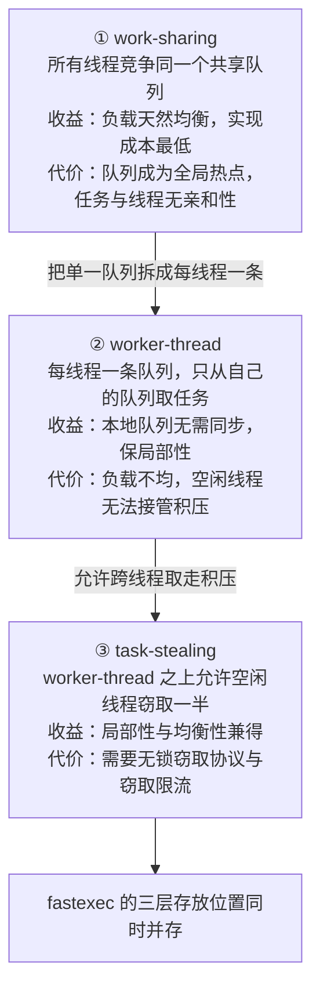

三种存放位置分别承载上述三代模型，并且在同一次运行中同时存在：

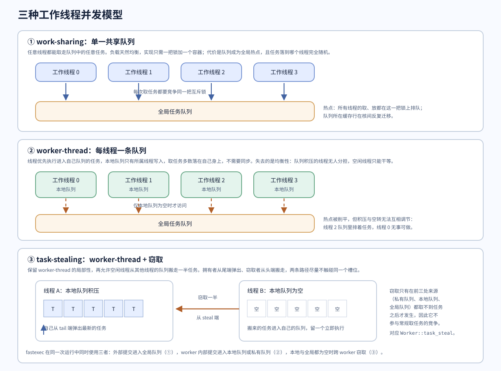

| 存放位置                   | 对应模型                    | 进入条件                                    | 同步成本                           |
| -------------------------- | --------------------------- | ------------------------------------------- | ---------------------------------- |
| `GlobalQueue`            | work-sharing                | 外部线程提交、本地队列溢出、worker 批量预取 | 全池共享一把互斥锁                 |
| `LocalQueue`             | worker-thread               | worker 内部提交且`stealable == true`      | 仅所属线程写，其他线程只读取并窃取 |
| `Worker::_private_queue` | worker-thread（不参与窃取） | worker 内部提交且`stealable == false`     | 完全线程私有，无同步               |

三者不是并列的可选项，而是逐级退化与组合的关系：

- 提交不可窃取任务时，模型**退化回纯 worker-thread**：任务进入 `_private_queue`，永远不会被其他线程取走，均衡性完全交给提交方自己保证。
- 外部线程提交时**必然经过 work-sharing 的全局队列**，因为此时不存在“自己的队列”；任务被哪个 worker 接收由全局队列的竞争结果决定。
- worker 取任务时可能**依次穿过三代模型**：先查私有队列（worker-thread 的私有部分），再查本地队列（worker-thread 的可窃取部分），本地为空则从全局队列批量预取（work-sharing），仍然无任务才去其他 worker 的本地队列窃取（task-stealing）。第 4.2 节的取任务优先级表就是这条顺序的完整表述。

### 2.2 分层与跨层协作

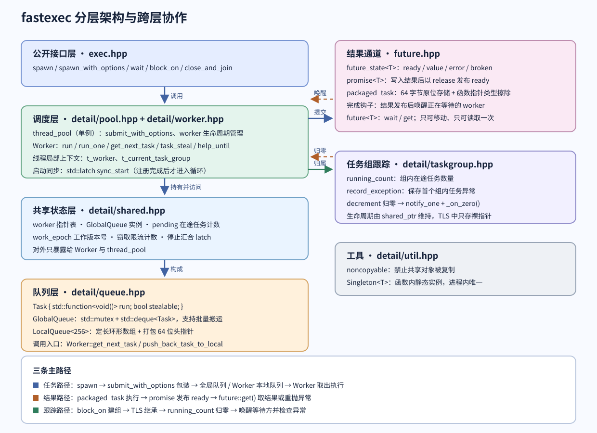

结构分成一条自下而上的依赖主链和三个横切模块。

依赖主链自上而下是：

1. **公开接口层**（[`exec.hpp`](../include/fastexec/exec.hpp)）只做参数转发与结果解包，不含并发逻辑。`spawn` 转发到单例线程池的 `submit`，`block_on` 在转发之前额外建立一个 `TaskGroup`。
2. **调度层**（[`pool.hpp`](../include/fastexec/detail/pool.hpp) 与 [`worker.hpp`](../include/fastexec/detail/worker.hpp)）承担全部调度决策：把用户函数包装成队列可存放的 `void()` 工作项、选择目标队列、创建工作线程、决定 worker 取任务的顺序。`thread_pool` 管提交与线程生命周期，`Worker` 管取任务与窃取，二者通过 `Shared` 通信而不直接持有彼此。
3. **共享状态层**（[`shared.hpp`](../include/fastexec/detail/shared.hpp)）是 worker 之间的唯一交汇点：全局队列实例、worker 指针表、在途计数、唤醒版本号、窃取限流计数、退出汇合都在这里。worker 之间没有相互引用，所有跨 worker 的信息都经过 `Shared`。
4. **队列层**（[`queue.hpp`](../include/fastexec/detail/queue.hpp)）提供两种容器：一把互斥锁保护的 `GlobalQueue` 和若干无锁的 `LocalQueue`。队列只负责存取，不做调度判断。

三个横切模块之所以独立，是因为它们同时被多个层使用：

- **结果通道**（[`future.hpp`](../include/fastexec/future.hpp)）被调度层（`submit_with_options` 创建 `packaged_task`）、worker（执行后写入结果、等待时登记钩子）和调用方（`future::get`）同时触及。它不依赖线程池，单独使用者可以只包含 `future.hpp`。
- **任务组跟踪**（[`taskgroup.hpp`](../include/fastexec/detail/taskgroup.hpp)）跨线程池与调用方：`block_on` 创建它，`submit_with_options` 为它计数，worker 执行完毕后减少计数。
- **工具**（[`util.hpp`](../include/fastexec/detail/util.hpp)）提供 `noncopyable` 与单例模板，被队列、`Shared` 和 `thread_pool` 共用。

依赖方向是单向的：队列层与结果通道不反向依赖调度层，`TaskGroup` 不依赖队列。`Worker` 访问 `Shared` 与队列、`submit_with_options` 访问队列与 `future_state`，都是自上而下。图中右侧的两组双向箭头是这条规则的两个例外，也是设计上刻意保留的耦合：

- 结果通道 ↔ 调度层：提交时建立 `future_state` 并注册完成钩子；结果发布时钩子回调 `Shared::signal_work`，唤醒可能正在等待该结果的 worker。
- 任务组 ↔ 调度层：提交时通过 TLS 找到当前组并增加计数，并让 `TaskGroup` 持有 `_on_zero` 回调；计数归零时回调线程池唤醒来唤醒等待方。

### 2.3 类型所有权与协作关系

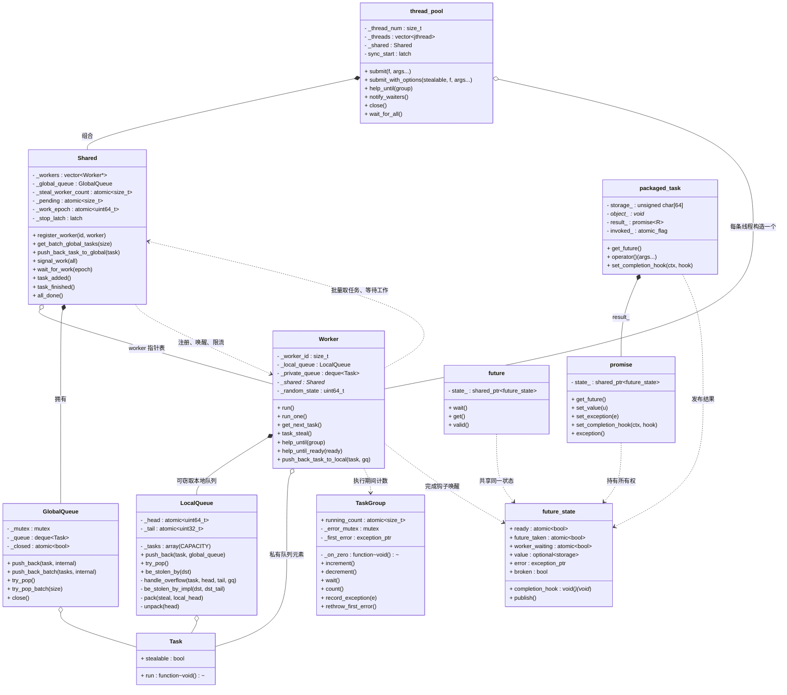

三处所有权关系决定了对象的生命周期：

- `thread_pool` 按值持有 `Shared`，`Shared` 按值持有 `GlobalQueue`。线程池销毁时，队列与计数器随之销毁，因此 `GlobalQueue` 的析构函数在未关闭时补一次 `close()`。
- `Shared` 只保存 `Worker*`，worker 的生命周期由 `thread_pool::_threads` 中的 `std::jthread` 决定。worker 在构造函数里把自己注册进 `Shared`，因此 `Shared` 中的指针在对应线程退出后立即失效，但退出后不会再有线程去读取它。
- `LocalQueue` 与私有队列由 `Worker` 按值持有。`LocalQueue` 只在所属 worker 线程存活期间被使用，窃取者通过 `Shared::get_workers()` 拿到目标 worker 指针后直接访问其 `_local_queue`。

`future` 与 `promise` 都不独占 `future_state`：双方用 `shared_ptr` 共享，因此即使调用方丢弃 `future`，生产者仍能把结果或异常写入状态；`packaged_task` 按值持有 `promise<R>`，是 `future_state` 的间接持有者。

### 2.4 三条主路径

图中的三条路径可以分别跟踪，它们在代码上几乎不重叠：

**任务路径。** `spawn` → `submit_with_options` → 全局队列或 worker 本地队列 → `Worker::run_one` 取出 → 调用 `std::function<void()>`。这条路径关心的是任务的存放位置与可见性。

**结果路径。** 提交时创建 `future_state<T>` 与 `packaged_task`；worker 执行 `packaged_task::operator()`，成功时 `set_value`、失败时 `set_exception`，二者最终都调用 `future_state::publish`；调用方 `future::get()` 以 acquire 读取 `ready`，再取结果或重抛异常。这条路径关心的是结果的安全发布与线程间传递。

**跟踪路径。** `block_on` 创建 `TaskGroup` 并写入 TLS → 根任务与所有后代在提交时增加 `running_count` → 每个工作项执行并清理后减少 → 归零时 `notify_one` 并触发 `_on_zero` 回调。这条路径关心的是“何时可以认为整棵子任务树已完成”。

## 3. 队列层

队列层是调度层与任务之间的缓冲区，也是整个项目里并发推理最密集的部分。它由三个类型组成：`Task` 描述任务本身，`GlobalQueue` 提供有锁的共享通道，`LocalQueue` 提供无锁的本地通道。

### 3.1 任务模型：`Task`

```cpp
// [queue.hpp:16-22]
// 任务的可窃取性在提交时确定。false 表示只能由接收它的 worker 执行；
// 从外部线程提交时由全局队列选择接收者，之后不会进入可窃取本地队列。
struct Task {
  std::function<void()> run;   // 类型擦除后的任务体，返回类型已经被丢弃
  bool stealable{true};        // 是否允许其他 worker 窃取
  void operator()() { run(); }
};
```

`Task` 把返回类型和异常都擦除了：队列只需要搬运“可以调用的零参数可调用对象”。返回值与异常通过 `packaged_task` + `future_state` 在另一条路径上传回调用方（见第 6 节），队列层对它们一无所知。这样队列的每个槽位是固定大小的布局，不需要为不同返回类型实例化不同队列。

`stealable` 是**提交时确定的任务属性**，不是运行时的调度状态。它的作用范围有两层：

- 在 worker 内部提交时，它决定任务进入 `LocalQueue`（可窃取）还是 `_private_queue`（不可窃取）。
- 从外部线程提交时，任务先进入全局队列，`stealable` 在取走它的 worker 手里才生效。调用方无法借此指定某个 worker，接收者由全局队列的竞争结果决定。

### 3.2 `GlobalQueue`：有锁的共享通道

`GlobalQueue` 是队列层里对应 work-sharing 模型的那一半，设计上只有一个要点：**基于互斥锁，不基于条件变量**。全部跨线程访问——入队、批量入队、单个弹出、批量弹出——都在同一把 `std::mutex` 下完成；取不到任务时立即返回空，不做任何条件等待，等待职责完全交给 worker 的版本号休眠机制（第 4.1 节）。提供批量接口是为了让 worker 一次搬运 `capacity / 2` 个任务，把锁的获取频率摊薄到原来的 1/128（第 4.2 节）。

`internal` 参数区分外部提交与 worker 内部提交：`close()` 与外部 `push_back` 在同一把锁下排序，关闭之后到达的外部提交一定抛异常；而正在运行的任务派生出的子任务走 `internal = true` 的通道，不受关闭影响，关闭因此不会切断已经运行的任务树。测试用例 [future_test.cpp:154-181](../tests/future_test.cpp#L154-L181) 覆盖了这条路径：主线程 `close()` 之后，正在运行的根任务仍然派生了 1000 个子任务并全部完成。`closed()` 读的是 `std::atomic<bool>`、不持锁，`close()` 中以 release 存储；持锁写入加无锁读取，让 `Worker::run` 能在每次循环里廉价地检查关闭标记。

### 3.3 `LocalQueue` 的设计约束

`LocalQueue` 是整个项目里唯一手写的无锁数据结构，它的形态由三条约束共同决定：

```cpp
// [queue.hpp:103-113]
// 本地队列 ，基于array,无锁，支持窃取操作
// 注意，该队列是单生产者多消费者队列
// 所以将头指针拆成两部分，加上通过cas更新，来保证线程安全
// 正常单线程操作情况：头指针两部分相等。
// 有其他线程操作队列的时候(窃取该队列)：两部分不相等
template <std::size_t CAPACITY = 256>
class LocalQueue {
  static_assert((CAPACITY & (CAPACITY - 1)) == 0,
                "CAPACITY must be power of 2");
  static_assert(CAPACITY > 0, "CAPACITY must be greater than 0");
```

- **定长 + 掩码取模。** 容量必须是 2 的幂，下标用 `序号 & (CAPACITY - 1)` 计算。环形数组避免了动态分配，也让窃取者能在不做分配的前提下批量搬运；掩码代替除法，热路径不含除法指令。
- **单生产者。** 只有所属 worker 会向尾部写入。这个前提让 `push_back` 可以对 `_tail` 使用普通的 load/store，不需要为尾指针做 CAS；也让生产者读到的 `_head` 快照足以做出局部判断。
- **多消费者。** 本地 `try_pop` 与任意数量的窃取者都会移动头部边界，所以头部必须用 CAS 更新，而且需要**两个**边界（下一小节）。

这三条约束共同解释了为什么不能直接换成 `std::deque` 或 `boost::lockfree::queue`：前者不支持多消费者无锁访问，后者是 MPSC 而不满足“其他线程批量搬运一半任务”的窃取语义。

### 3.4 头指针编码：为什么需要两个边界

```cpp
// [queue.hpp:357-387]
  constexpr static inline std::size_t _mask =
      CAPACITY - 1;  // 掩码，用于取模操作
  /*
   * 功能 ：将两个32位整数合并成一个64位整数
   * 实现原理 ：
   *    static_cast<uint64_t>(steal) << 32
   * ：将第一个参数转换为64位并左移32位，放在高32位
   * static_cast<uint64_t>(local_head) ：将第二个参数转换为64位，占据低32位
   * 使用按位或操作符 | 将两部分合并
   */
  [[nodiscard]]
  static auto pack(uint32_t steal, uint32_t local_head) -> uint64_t {
    return static_cast<uint64_t>(steal) << 32 |
           static_cast<uint64_t>(local_head);
  }
  /*
   * 功能:将64位头指针拆成两部分，每个部分32位
   * 高32位代表窃取指针，低32位代表本地头指针
   * 实现原理 ：
   *   head >> 32 ：右移32位，获取高32位的值
   *   static_cast<uint32_t>(head) ：直接转换为32位整数，自动截取低32位
   */
  [[nodiscard]]
  static auto unpack(std::uint64_t head) -> std::pair<uint32_t, uint32_t> {
    return {static_cast<uint32_t>(head >> 32), static_cast<uint32_t>(head)};
  }

 private:
  std::array<std::function<void()>, CAPACITY> _tasks{};  // 固定数组存放任务
  std::atomic<std::uint64_t> _head{};  // 64位头指针，用于生产和窃取任务
  std::atomic<std::uint32_t> _tail{};  // 32位尾指针，用于消费任务
```

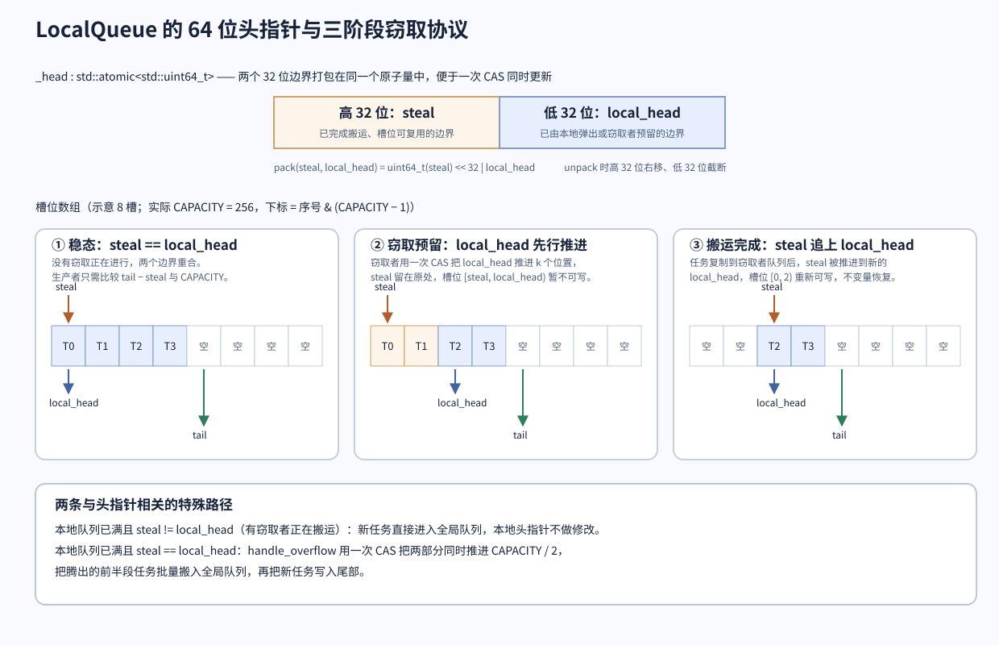

单个“头部序号”不足以描述窃取的中间状态。窃取需要两步：先把一段任务**标记为已被预留**（防止本地弹出者继续取走它们），再把任务内容复制到窃取者队列，最后才能宣布槽位**可以复用**。这两步之间，生产者必须能识别出“这段槽位已经不属于任何人，但还不能覆盖”。

于是头部被拆成两个边界，打包进同一个 64 位原子量：

- 低 32 位 `local_head`：本地弹出或窃取者预留的边界。**任务从这一侧取走。**
- 高 32 位 `steal`：已完成搬运、槽位真正可复用的边界。**槽位从这一侧归还给生产者。**

**打包的目的**是让这两个边界的更新可以分两次、却各自是原子的 CAS：预留时只推进 `local_head` 而保持 `steal` 不变，完成时只推进 `steal` 到新的 `local_head`。如果两半是独立的原子变量，就得为“同时读取一致性”再加一层协议，而一次 64 位 CAS 天然给出了快照。

`push_back_batch` 里有一处值得注意的用法——它只解包出 `steal`，用 `tail - steal < CAPACITY` 判断是否有空间：

```cpp
// [queue.hpp:147-158]
  // 尝试批量将任务推送到队列末尾
  void push_back_batch(std::span<std::function<void()>> tasks) {
    assert(0 < tasks.size() && tasks.size() <= capacity());
    auto [steal, _] = unpack(_head.load(std::memory_order::acquire));
    auto tail = _tail.load(std::memory_order::relaxed);
    for (auto&& task : tasks) {
      std::size_t idx = tail & _mask;
      _tasks[idx] = std::move(task);
      tail += 1;
    }
    _tail.store(tail, std::memory_order::release);
  }
```

它只用 `steal` 而非 `local_head` 判断可用空间：`local_head` 之后的槽位可能正被本地弹出者或窃取者占用，`steal` 才是“确认归还”的边界。因为单生产者，`_tail` 用 relaxed 读取即可，最后以 release 存储发布这批任务。

### 3.5 入队：快路径与溢出

```cpp
// [queue.hpp:160-188]
  // 尝试将任务推送到队列末尾,如果队列已满,则尝试将队列中的任务转移到全局队列
  void push_back(std::function<void()> task, GlobalQueue& global_queue) {
    // step 1 : 溢出处理
    //  预先定义尾指针变量
    std::uint32_t tail = 0;
    // handle_overflow使用了compare_exchange_weak,所以这里需要循环重试
    while (true) {
      auto head = _head.load(std::memory_order::acquire);
      auto [steal, local_head] = unpack(head);
      tail = _tail.load(std::memory_order::acquire);
      // 如果尾指针与窃取指针的差值小于队列容量，说明队列未满，直接跳出循环
      if (tail - steal < static_cast<std::uint32_t>(CAPACITY)) {
        break;
      } else if (steal != local_head) {
        // 队列已满,且头指针与实际头指针不同,说明有其他线程在窃取任务
        // 尝试将任务推送到全局队列
        global_queue.push_back(Task{std::move(task), true}, true);
        return;
      } else {
        // 正常调用处理溢出
        if (handle_overflow(task, local_head, tail, global_queue)) {
          return;
        }
      }
    }
    // step 2 : 将任务存储在数组中,更新头指针
    _tasks[tail & _mask] = std::move(task);
    _tail.store(tail + 1, std::memory_order::release);
  }
```

入队分成两段，第一段决定“能不能写”，第二段写并发布。可用空间的判据是 `tail - steal < CAPACITY`：`[steal, tail)` 是当前真正被占用的连续区间，其余槽位可以覆盖。

满队列时有两个分支，区别在于**是否有窃取正在进行**：

- `steal != local_head`：说明窃取者已经预留了一段，但还没搬运完。此时本地头指针被预留逻辑冻结，不能通过搬运自救，于是新任务直接进入全局队列（`internal = true`，因为这是 worker 内部的溢出，不受关闭影响），本地状态完全不动。
- `steal == local_head`：没有窃取在途，可以走 `handle_overflow` 主动腾空间。返回 `false` 表示 CAS 失败（期间有窃取者介入），外层 `while` 重新读取头指针再判断。

第二段的顺序是**先写槽位、再以 release 发布尾指针**。`_tail.store(tail + 1, release)` 与消费方的 acquire 配对，保证槽位内容的写入先于尾指针的可见性（与 6.1 节结果发布使用的是同一类推理）。

```cpp
// [queue.hpp:257-288]
 private:
  // 处理队列溢出,将本地队列中一半的任务转移到全局队列
  bool handle_overflow(std::function<void()> task, std::uint32_t local_head,
                       std::uint32_t tail, GlobalQueue& global_queue) {
    // step1 : 更新头指针
    // 1.获取到队列容量的一半作为默认转移的数量
    auto take_len = static_cast<std::uint32_t>(CAPACITY / 2);
    assert(tail - local_head);
    // 2.打包当前头指针
    auto cur_head = pack(local_head, local_head);
    // 3.打包下一个头指针
    auto next_head = pack(local_head + take_len, local_head + take_len);
    // 4.更新头指针
    if (!_head.compare_exchange_weak(cur_head, next_head,
                                     std::memory_order::relaxed)) {
      return false;
    }

    // step2 : 转移任务到一个临时vector
    // 1.将take_len数量的任务从本地队列转移到一个临时定义的vector内
    std::vector<Task> tasks;
    for (int i = 0; i < take_len; i++) {
      std::size_t idx = static_cast<std::size_t>(local_head + i) & _mask;
      tasks.push_back(Task{std::move(_tasks[idx]), true});
    }
    // 2.将触发溢出的任务添加到vector内
    tasks.push_back(Task{std::move(task), true});

    // step3 : 将vector内的任务批量推送到全局队列
    global_queue.push_back_batch(tasks, true);
    return true;
  }
```

`handle_overflow` 一次转移 `CAPACITY / 2` 个任务，即 256 容量下的 128 个。三个步骤的顺序很关键：

1. **先 CAS 推进头部，且两半同时推进。** `pack(local_head + take_len, local_head + take_len)` 让 `steal` 与 `local_head` 一起前进，语义是“这半段的任务所有权已经交出去了，槽位既不归本地弹出者也不归窃取者”。CAS 用的是 `pack(local_head, local_head)` 作为期望值，隐含要求进入本函数时 `steal == local_head`（调用点已经判断过）。写入方是单生产者，所以用 relaxed 就足够——这一步不需要与其他线程交换任何非头指针数据。
2. **再搬任务。** 搬运发生在头部推进之后，此时其他线程已经不可能取到这段任务：本地弹出者看到 `local_head` 已经越过它们，窃取者也一样。搬运目标是临时 `vector<Task>`，`Task` 的 `stealable` 被强制设为 `true`——任务一旦进入全局队列，接收它的 worker 可以再次决定存放位置。
3. **最后批量入全局队列。** 触发溢出的那个新任务被追加到同一批里，因此调用方在 `push_back` 里看到 `handle_overflow` 返回 `true` 就直接 `return`，新任务不会重复写入本地数组。

这一步是本模块异常安全性最弱的位置：头部在搬运和入队之前就已经推进，如果 `std::vector` 的分配失败，这 128 个任务既不在本地队列的可达范围内，也没有进入全局队列。`std::function` 的移动构造一般不会抛异常，但重分配和 `deque::insert` 会。这是队列层异常安全性最弱的位置。

### 3.6 出队：`try_pop`

```cpp
// [queue.hpp:190-222]
  // 尝试从队列头部弹出任务
  // 这个队列是多消费者队列，所以需要用cas操作来更新头指针。
  std::optional<std::function<void()>> try_pop() {
    auto cur_head = _head.load(std::memory_order::acquire);
    std::size_t index = 0;
    while (true) {
      auto [cur_steal, cur_local_head] = unpack(cur_head);
      auto tail = _tail.load(std::memory_order::acquire);
      // 如果实际头指针等于尾指针，说明队列为空
      if (cur_local_head == tail) {
        return std::nullopt;
      } else {
        // 得到下一个实际头指针
        auto next_local_head = cur_local_head + 1;
        // 得到下一个完整头指针，
        auto next_head = (cur_local_head == cur_steal)
                             ? pack(next_local_head, next_local_head)
                             : pack(cur_steal, next_local_head);

        // 尝试更新头指针,如果失败,说明有其他线程在更新头指针,需要重试
        if (_head.compare_exchange_weak(cur_head, next_head,
                                        std::memory_order::acq_rel,
                                        std::memory_order::acquire)) {
          // 成功，获得当前任务的索引,并且退出循环
          index = static_cast<std::size_t>(cur_local_head) & _mask;
          break;
        }
      }
    }
    auto task = std::move(_tasks[index]);
    _tasks[index] = nullptr;
    return task;
  }
```

`try_pop` 用 CAS 占据队首序号来保证“一个任务只被弹出一个消费者”。循环的每一步都基于 `cur_head` 的最新值构造 `next_head`，CAS 失败时 `compare_exchange_weak` 会把 `cur_head` 更新为当前值并重试。

关键在于 `next_head` 的构造分两种情况：

- `cur_local_head == cur_steal`：没有窃取在途，两半同步推进，`steal` 跟随 `local_head`，槽位立即可以复用。
- `cur_local_head != cur_steal`：窃取者已经预留了一段，此时 `steal` 不能动（它代表“搬运完成”的边界），只能推进 `local_head`。如果在这里把 `steal` 一起推进，会错误地宣告槽位可复用以至于被生产者覆盖，而窃取者还在读这些槽位。

CAS 成功之后才读取槽位内容并把它置空。置空 `_tasks[index] = nullptr` 会释放任务持有的 `std::function` 目标，避免队列长期持有已完成任务的资源。

空判断用的是 `cur_local_head == tail`。注意这里不能用 `steal == tail`：`local_head` 才是“已被取走的边界”，被预留但未搬走的任务对本地弹出者而言已经不可取，队列应当报告为空。

`try_pop` 同时被两类调用者使用：所属 worker 自己（`Worker::get_next_task` 的快路径）和窃取者（通过 `be_stolen_by` 走的是另一条批量路径，见下一节）。因此它的 CAS 是必须的，而不是防御性代码。

### 3.7 窃取：`be_stolen_by` 与三阶段协议

窃取由两个函数配合完成。外层负责**判断与收尾**，内层负责**预留与搬运**。整体控制流是：

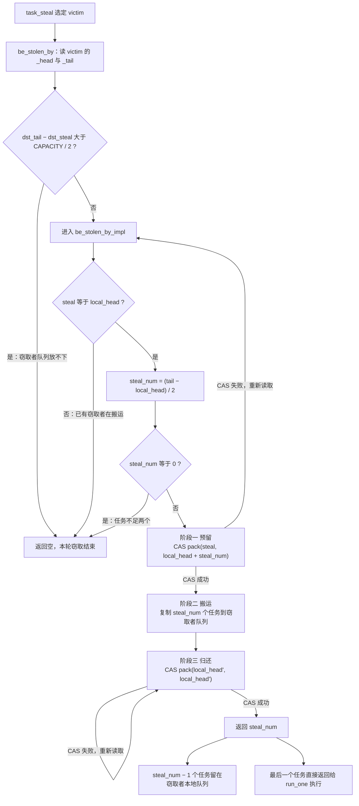

图中三条通往“返回空”的路径互不重叠，分别对应容量不足、已有窃取者、任务不足两个这三种放弃条件；两条 CAS 重试路径则分别处理预留竞争与归还期间的本地弹出进度。

```cpp
// [queue.hpp:223-255]
  // 当前队列被目标队列窃取
  // 返回最后一个被窃取的任务
  std::optional<std::function<void()>> be_stolen_by(LocalQueue& dst_queue) {
    std::optional<std::function<void()>> result{std::nullopt};
    auto [dst_steal, dst_local_head] =
        unpack(dst_queue._head.load(std::memory_order::acquire));
    auto dst_tail = dst_queue._tail.load(std::memory_order::acquire);
    // 如果目标队列的已有任务大于队列容量的一半,无法进行窃取操作，直接返回空
    if (dst_tail - dst_steal > static_cast<std::uint32_t>(CAPACITY) / 2) {
      return result;
    }
    // 进行窃取并且更新头指针
    auto steal_num = be_stolen_by_impl(dst_queue, dst_tail);

    // 如果窃取数量为0,说明没有任务被窃取,直接返回空
    if (steal_num == 0) {
      return result;
    }
    // 窃取数量减1,表示拿出最后一个被窃取的任务
    steal_num = steal_num - 1;
    // 得到新的目标队列尾指针
    auto next_dst_tail = dst_tail + steal_num;
    // 得到最后一个任务的索引
    auto idx = static_cast<std::size_t>(next_dst_tail) & _mask;
    // 填充结果，最后一个被窃取的任务
    result.emplace(std::move(dst_queue._tasks[idx]));
    // 如果窃取数量仍然大于0,更新目标队列的尾指针
    if (steal_num > 0) {
      // 更新目标队列的尾指针
      dst_queue._tail.store(next_dst_tail, std::memory_order::release);
    }
    return result;
  }
```

`this` 是被窃取的 victim，`dst_queue` 是窃取者自己的队列（也就是 `Worker::task_steal` 里的 `this->_local_queue`）。三个设计点：

**目标队列容量检查。** `dst_tail - dst_steal > CAPACITY / 2` 时直接放弃。窃取一次最多搬走一半任务，所以目标队列至少要有半个容量的空位，否则窃取者的队列会溢出。判据同样用 `steal` 而非 `local_head`，因为 `[steal, local_head)` 的槽位虽然已归还给生产者，却可能刚被写入新任务。

**留一个任务自己执行。** 搬完之后 `steal_num - 1`，把最后一个任务从窃取者队列里取出来直接返回。这个设计避免了“搬运完成但窃取者仍无任务可执行”的空转：窃取者拿到一个立即可运行的任务，其余任务留在自己的本地队列供后续使用。

**尾指针的发布方式。** 取走的那个任务对应的槽位不进入发布范围：`next_dst_tail = dst_tail + steal_num`（此时 `steal_num` 已减 1）刚好等于被取走任务的序号，因此 `_tail` 被设为它的位置而不是它的下一位，这个槽位不会被其他 consumer 取到。取走任务的操作发生在 `_tail.store(..., release)` **之前**，所以窃取者自身对槽位的写入先于尾指针发布；只有当剩余任务数量大于 0 时才需要发布。

内层是三阶段协议的核心：

```cpp
// [queue.hpp:290-354]
  // 当前队列被目标队列窃取(头指针更新+窃取操作封装)
  // 主要逻辑 ：
  // 1.将当前队列任务的一半所为窃取任务数量，保持窃取指针不变，得到新的本地头指针(当前头指针+窃取数量)，打包成完成头指针通过cas更新
  // 2.根据窃取数量，目标队列窃取当前队列的任务
  // 3.获取到之前更新后的头指针作为当前指针，更新当前队列的窃取指针，将窃取指针等于本地头指针，合并成一个64位整数，通过cas更新
  std::uint32_t be_stolen_by_impl(LocalQueue& dst, std::uint32_t dst_tail) {
    // step1 :
    // 更新整体头指针-更新本地头指针，窃取指针不动,告诉其他线程我开始窃取任务了
    std::uint64_t cur_src_head = _head.load(std::memory_order::acquire);
    std::uint64_t next_src_head = 0;
    std::uint32_t steal_num = 0;
    while (true) {
      auto [cur_src_steal, cur_src_local_head] = unpack(cur_src_head);
      auto cur_src_tail = _tail.load(std::memory_order::acquire);
      auto cur_src_size = cur_src_tail - cur_src_local_head;
      // 如果窃取指针不等于实际头指针，说明有其他线程在窃取任务
      if (cur_src_steal != cur_src_local_head) {
        return 0;
      }
      // 1. 计算当前队列中可窃取的任务数量
      // 2. 取当前队列大小的一半作为窃取数量
      steal_num = cur_src_size / 2;
      if (steal_num == 0) {
        return 0;
      }
      // 3.更新下一个本地头指针,值为当前头指针加上窃取数量
      auto next_src_local_head = cur_src_local_head + steal_num;
      // 4.确保下一个头指针不等于当前头指针,如果相等,说明队列只有一个任务,无法窃取
      assert(cur_src_steal != next_src_local_head);
      // 5.打包下一个头指针，窃取指针不变，和下一个本地头指针合并成一个64位整数
      next_src_head = pack(cur_src_steal, next_src_local_head);
      if (_head.compare_exchange_weak(cur_src_head, next_src_head,
                                      std::memory_order::acq_rel,
                                      std::memory_order::acquire)) {
        break;
      }
    }

    // step2 : 窃取任务
    // 1.从next_src_steal开始,窃取steal_num数量的任务
    auto [next_src_steal, next_src_local_head] = unpack(next_src_head);
    for (std::uint32_t i = 0; i < steal_num; i++) {
      // 2.将窃取到的任务移动到目标队列的对应位置
      auto src_idx = static_cast<std::uint32_t>(next_src_steal + i) & _mask;
      auto dst_idx = static_cast<std::uint32_t>(dst_tail + i) & _mask;
      dst._tasks[dst_idx] = std::move(_tasks[src_idx]);
    }

    // step3 : 更新整体头指针-更新窃取指针，让窃取指针等于本地头指针
    // 1.将之前的下一个头指针更新成当前指针
    cur_src_head = next_src_head;
    // 2.更新
    while (true) {
      // 2.1 从当前头指针中提取当前窃取指针和当前本地头指针
      auto [cur_src_steal, cur_src_local_head] = unpack(cur_src_head);
      // 2.2 打包下一个头指针，让窃取指针和本地头指针一致，合并成一个64位整数
      next_src_head = pack(cur_src_local_head, cur_src_local_head);
      // 2.3 尝试更新头指针,如果成功,返回窃取数量
      if (_head.compare_exchange_weak(cur_src_head, next_src_head,
                                      std::memory_order::acq_rel,
                                      std::memory_order::acquire)) {
        return steal_num;
      }
    }
  }
```

**阶段一：预留。** 循环从读取 `cur_src_head` 开始，先检查 `steal == local_head`——不相等意味着另一个窃取者正在搬运，直接返回 0 放弃，避免两个窃取者对同一段任务重复搬运。窃取数量取 `(tail - local_head) / 2`，只有一个任务时结果为 0 并放弃（一次偷一半的算法无法搬运单个任务，`assert` 也印证了这一点）。

预留的动作是 `pack(cur_src_steal, cur_src_local_head + steal_num)`：**推进 `local_head`，`steal` 保持不动**。这一步成功后：

- 本地 `try_pop` 会看到 `local_head != steal` 并因此拒绝把 `steal` 一起推进（见 3.6 节），槽位在被搬运期间不会被本地弹出者改写；
- 生产者会看到 `tail - steal` 仍然计入这段槽位，因此不会覆盖它们；
- 另一个窃取者会看到 `steal != local_head` 而放弃。

也就是说，仅靠一次 32 位推进就同时冻结了三条访问路径。CAS 用 `acq_rel`：acquire 部分保证读到槽位内容所需的可见性（与生产者的 release 存储配对），release 部分保证预留对后续读者可见。

**阶段二：搬运。** 从 `next_src_steal + i` 开始复制 `steal_num` 个任务到目标队列的 `dst_tail + i`。因为阶段一已经把所有其他访问者挡在外面，这里的读取不需要额外的同步；目标槽位也是窃取者独占的（`be_stolen_by` 已经检查过容量）。

**阶段三：归还。** 把 `steal` 推进到阶段一算出的 `local_head`，两半重新相等。这一步用 CAS 而不是直接 store：期间本地弹出者可能已经继续推进过 `local_head`（`next_src_local_head` 之后的位置），直接 store 会把这个进度回退。循环从 `cur_src_head = next_src_head` 出发，每次读取当前值并把 `steal` 推到其中的 `local_head`，直到成功。返回 `steal_num` 给外层使用。

把三个阶段放回两个队列之间看，victim 与窃取者的槽位变化是：

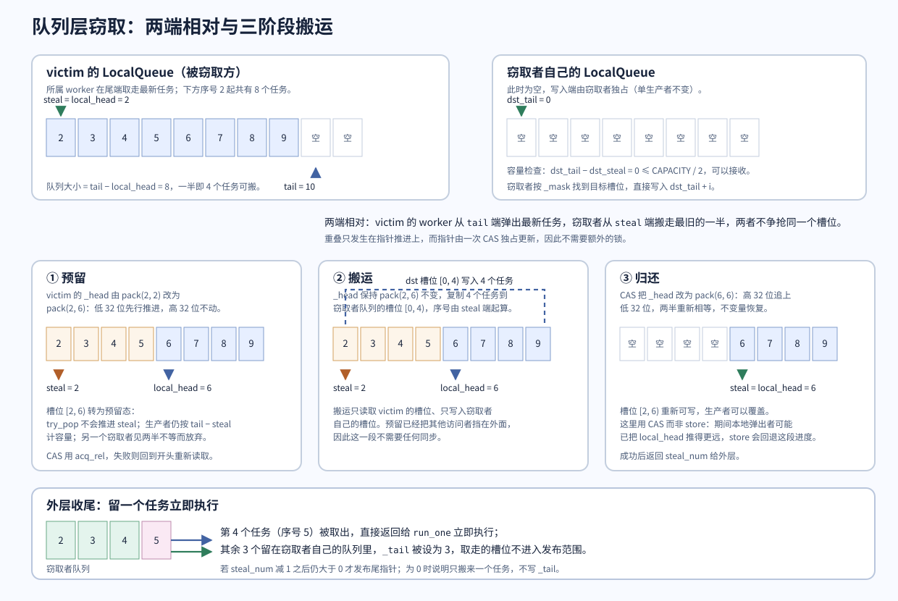

上图中 victim 队列的序号 2 起有 8 个任务，`steal == local_head == 2`、`tail == 10`，因此 `steal_num = (10 − 2) / 2 = 4`。阶段一之后 `local_head` 变为 6，槽位 `[2, 6)` 只剩“可读不可写”；阶段二把序号 2 至 5 这四个任务复制到窃取者队列的槽位 `[0, 4)`；阶段三把 `steal` 推到 6，四个槽位重新可写。外层随后取走窃取者队列里的第 4 个任务立即执行，剩下 3 个留在队列中，`_tail` 被设为 3。

一次窃取在两条队列上分别表现为“**生产者视角的一段冻结**”和“**消费者视角的一次批量写入**”：victim 一侧的代价是头指针被推进两次，窃取者一侧的代价是四次移动构造加一次尾指针发布。整个过程中没有任何时刻需要同时持有两把锁，因为协议靠头指针的中间状态而不是互斥来串行化。

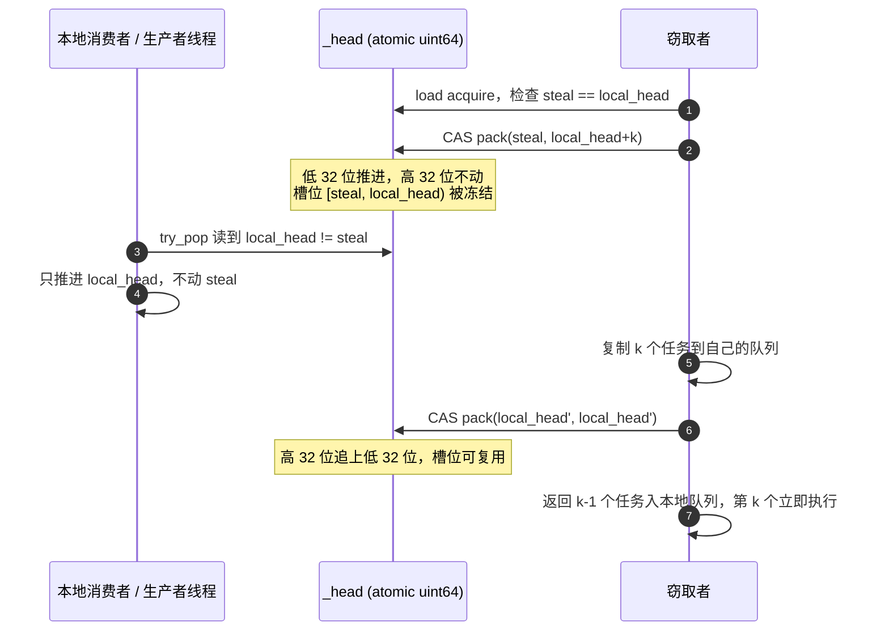

## 4. 调度层：Worker

`Worker` 承担任务从“躺在某个队列里”到“被执行”的全部决策。它持有三类资源：可窃取的本地队列、不可窃取的私有队列、与线程池共享的 `Shared`。此外它还持有一个线程局部的身份标记，供提交路径和结果通道判断“当前是否处于 worker 内部”。

```cpp
// [worker.hpp:16-40]（节选）
class Worker;
inline thread_local Worker *t_worker{nullptr};   // 当前线程的 worker 身份，外部线程为 nullptr

class Worker {
  friend class Shared;

public:
  Worker(Shared *shared, std::size_t worker_id)
      : _shared(shared), _worker_id(worker_id),
        _random_state(0x9e3779b97f4a7c15ULL ^
                      (worker_id + 1) * 0xbf58476d1ce4e5b9ULL) {
    _shared->register_worker(static_cast<int>(worker_id), this);
    t_worker = this;                                 // 建立线程局部身份
    fastexec::detail::future_help_context = this;     // 结果通道的协作等待钩子
    fastexec::detail::future_help = [](void *worker,
                                       const std::atomic<bool> &ready) {
      static_cast<Worker *>(worker)->help_until_ready(ready);
    };
  }
  ~Worker() {
    t_worker = nullptr;
    fastexec::detail::future_help = nullptr;
    fastexec::detail::future_help_context = nullptr;
    _shared->_stop_latch.arrive_and_wait();   // 退出前与其他 worker 汇合
  }
```

**成员与职责**

| 成员               | 类型                 | 作用                               |
| ------------------ | -------------------- | ---------------------------------- |
| `_local_queue`   | `LocalQueue<256>`  | 可窃取任务；本 worker 是唯一生产者 |
| `_private_queue` | `std::deque<Task>` | 不可窃取任务；只被本线程访问       |
| `_shared`        | `Shared*`          | 访问全局队列、计数、唤醒协议       |
| `_worker_id`     | `std::size_t`      | 注册进`Shared::_workers` 的下标  |
| `_random_state`  | `std::uint64_t`    | 窃取起点的 xorshift64 状态         |

**构造函数建立的两条线程局部的链接。** 一是 `t_worker`，让 `submit_with_options` 能判断“我在 worker 内部”，从而把任务放进自己的本地队列而不是全局队列。二是 `future_help` / `future_help_context` 这一对函数指针，把结果通道的协作等待回调指向 `help_until_ready`。使用函数指针而不是直接调用，是为了让 [`future.hpp`](../include/fastexec/future.hpp) 不依赖 [`worker.hpp`](../include/fastexec/detail/worker.hpp)——结果通道保持为独立模块，只有线程池在构造 worker 时才把两者接起来。

**析构函数的汇合点。** 退出工作循环后，worker 在析构函数里到达 `_stop_latch.arrive_and_wait()`；`std::latch` 的计数是 worker 数量，因此最后一个到达的 worker 会立即通过，其余则已经通过。这里等待的是一个汇合屏障，用来保证所有 worker 都已经停止从队列取任务之后，`thread_pool` 才开始 `join` 线程（见第 8 节）。同时清空两个 TLS 钩子，避免线程复用（`std::jthread` 退出）后残留指针。

### 4.1 工作循环 `run`

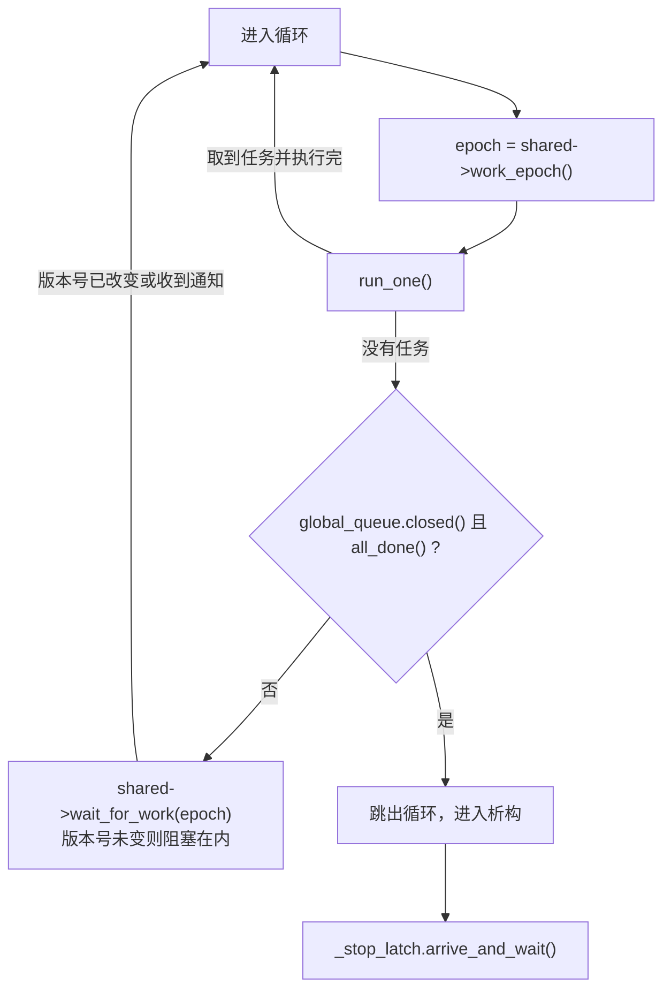

循环体只有四步，并且顺序不可交换：版本号的读取必须发生在检查队列之前，退出条件必须在休眠之前判断。下面逐段看它的实现。

```cpp
// [worker.hpp:42-54]
  // 快路径只查自己的队列；空闲时依次查全局队列和随机起点的其他 worker。
  // 工作版本号在查队列前获取，atomic::wait 只在版本号未改变时睡眠，
  // 既不反复执行 100us 定时唤醒，也不会漏掉检查期间提交的任务。
  void run() {
    for (;;) {
      const auto epoch = _shared->work_epoch();   // ① 先取版本号
      if (run_one())                              // ② 再尝试取任务
        continue;
      if (_shared->get_global_queue().closed() && _shared->all_done())
        break;                                    // ③ 退出条件
      _shared->wait_for_work(epoch);               // ④ 版本号未变则休眠
    }
  }
```

四步中每一步承担的责任：

1. **读取 `_work_epoch`。** 这是一个原子快照，代表“我开始找工作了”。
2. **`run_one()` 尝试执行一个任务。** 成功就回到循环开头重新取版本号——写任务或被唤醒都会递增版本号，所以重新取值是必要的。
3. **检查退出条件。** 需要“全局队列已关闭”**且**“在途任务数为零”同时成立。只满足前者说明还有任务在运行或排队；只满足后者说明外部还可能继续提交。两者同时成立时，已经不存在能产生新任务的来源：外部提交被关闭标记拒绝，worker 内部的提交又必须先有一个正在运行的任务。
4. **`wait_for_work(epoch)`。** 内部是 `_work_epoch.wait(epoch, acquire)`，当且仅当 `_work_epoch` 的值仍等于 `epoch` 时阻塞。如果第 ① 步之后、第 ④ 步之前有提交、唤醒或计数归零发生，`epoch` 会改变，`wait` 立即返回而不睡眠。

**无锁定时器，也没有丢失唤醒。** 注释里提到的 “100us 定时唤醒” 指向一种常见的替代实现：用带超时的等待周期性重试。本实现不需要超时，因为唤醒方与休眠方共享同一个版本号。表 4-1 给出四种竞争交错下的结果：

| 提交发生的时刻         | `epoch` 是否变化         | 结果                                         |
| ---------------------- | -------------------------- | -------------------------------------------- |
| 第 ① 步之前           | 是（worker 读到新值）      | 第 ② 步的`run_one` 取到任务               |
| 第 ① 步与第 ② 步之间 | 是                         | 第 ② 步的`run_one` 取到任务（队列已可见） |
| 第 ② 步与第 ④ 步之间 | 是                         | `wait` 看到值已变，立即返回并重新循环      |
| 第 ④ 步之后           | 是（提交方`notify_one`） | `atomic::wait` 被唤醒                      |

*表 4-1：唤醒协议在四种交错下的正确性。*

这条推理要求所有可能产生新工作的路径**一定**递增版本号。全部递增点共七处：外部提交进入全局队列、worker 提交进入自己的本地队列、worker 批量搬运后唤醒窃取者、`_pending` 归零、任务组归零、future 结果发布、全局队列关闭。任何一条路径漏掉递增，都会把 worker 永久留在休眠中。

### 4.2 取任务：`run_one` 与 `get_next_task`

```cpp
// [worker.hpp:80-88]
  bool run_one() {
    auto task = get_next_task();
    if (!task)
      task = task_steal();   // 本地与全局都没有，才去窃取
    if (!task)
      return false;
    (*task)();               // 任务体在 worker 线程上执行
    return true;
  }
```

```cpp
// [worker.hpp:100-129]
private:
  std::optional<Task> get_next_task() {
    if (!_private_queue.empty()) {                 // ① 私有队列优先
      auto task = std::move(_private_queue.front());
      _private_queue.pop_front();
      return task;
    }
    if (auto local = _local_queue.try_pop())       // ② 本地可窃取队列
      return Task{std::move(*local), true};

    // 批量从全局队列搬运，摊薄全局锁的成本。不可窃取任务在这里绑定到当前
    // worker。
    const auto batch = _local_queue.capacity() / 2; // ③ 批量大小 = 128
    auto tasks = _shared->get_batch_global_tasks(batch);
    if (!tasks)
      return std::nullopt;
    auto current = std::move(tasks->back());        // ④ 留一个立即执行
    tasks->pop_back();
    for (auto &task : *tasks) {                     // ⑤ 其余按属性分流
      if (task.stealable)
        _local_queue.push_back(std::move(task.run),
                               _shared->get_global_queue());
      else
        _private_queue.push_back(std::move(task));
    }
    // 一批可窃取任务刚进入本地队列，唤醒休眠中的窃取者。
    if (!tasks->empty())
      _shared->signal_work(true);                   // ⑥ 通知其他 worker
    return current;
  }
```

**取任务的优先级反映的是访问成本**，而不是公平性：

| 顺序 | 来源                     | 同步成本       | 备注                         |
| ---- | ------------------------ | -------------- | ---------------------------- |
| ①   | `_private_queue`       | 无（线程私有） | 不可窃取任务只能在这里被取到 |
| ②   | `_local_queue.try_pop` | 一次 CAS       | 单任务粒度，命中率最高       |
| ③   | 全局队列批量搬运         | 一次互斥锁     | 一次最多 128 个，摊薄锁开销  |
| ④   | 其他 worker 的本地队列   | 若干次 CAS     | 由`task_steal` 完成        |

**批量搬运是全局队列的核心优化。** 如果每次只取一个任务，每次都要竞争全局互斥锁；批量取 128 个之后，锁的获取频率下降到原来的 1/128。搬运进来的任务按 `stealable` 分流：可窃取的进入 `_local_queue` 供其他 worker 窃取，不可窃取的进入 `_private_queue` 并**在这里绑定到当前 worker**——这正是提交时无法指定 worker、只能由全局队列“选择接收者”的原因。

**④ 处留一个任务立即执行**，与窃取路径留一个任务的动机相同：避免把刚搬来的任务全部入队后自己反而无任务可执行。

**⑥ 处唤醒窃取者**是关键的一步。这批任务进入了本地队列，但本 worker 只执行其中一个，其余 127 个是其他空闲 worker 的潜在工作。此时版本号递增并 `notify_all`，休眠中的 worker 会被唤醒并在 `task_steal` 中看到这批新任务。

### 4.3 窃取：`task_steal`

```cpp
// [worker.hpp:131-158]
  std::uint64_t next_random() {
    // 每个 worker 独立的 xorshift64 状态，热路径无全局随机数锁。
    auto x = _random_state;
    x ^= x << 13;
    x ^= x >> 7;
    x ^= x << 17;
    return _random_state = x;
  }

  std::optional<Task> task_steal() {
    auto workers = _shared->get_workers();
    if (workers.size() < 2 || !_shared->can_steal_task())
      return std::nullopt;                       // ① 无人可偷 / 限流
    _shared->increment_steal_worker_count();     // ② 声明自己开始窃取
    // 随机起点、顺序轮询：平均分散热点，且一次失败后仍能检查所有目标。
    const auto start = next_random() % workers.size();
    for (std::size_t step = 0; step < workers.size(); ++step) {
      auto *victim = workers[(start + step) % workers.size()];  // ③ 环形轮询
      if (victim == this)
        continue;                                 // ④ 跳过自己
      if (auto stolen = victim->_local_queue.be_stolen_by(_local_queue)) {
        _shared->decrement_steal_worker_count();
        return Task{std::move(*stolen), true};    // ⑤ 成功即返回
      }
    }
    _shared->decrement_steal_worker_count();
    return std::nullopt;
  }
```

**随机起点 + 环形轮询。** 起点由 worker 自己的 xorshift64 状态决定，不共享任何全局随机数生成器，因此选取起点没有锁竞争。起点是随机的而不是固定的（例如总是 `id + 1`），目的是把窃取压力分散到不同 victim；`(start + step) % size` 保证在一次调用里仍然会检查到每一个其他 worker，所以随机化不会牺牲覆盖率。

**限流。** `can_steal_task()` 检查当前正在窃取的 worker 数量是否小于 `worker 总数 / 2`：

```cpp
// [shared.hpp:96-109]
  // 增加窃取任务的 worker 数量
  void increment_steal_worker_count() {
    _steal_worker_count.fetch_add(1, std::memory_order::release);
  }
  // 减少窃取任务的 worker 数量
  void decrement_steal_worker_count() {
    _steal_worker_count.fetch_sub(1, std::memory_order::release);
  }

  // 判断是否可以窃取任务
  bool can_steal_task() const {
    return _steal_worker_count.load(std::memory_order::acquire) <
           (_workers.size() / 2);
  }
```

限流的作用是抑制“所有 worker 同时互相窃取”的抖动：窃取本身要争用受害者的 `_head` CAS，如果空闲 worker 全都扑向同一批队列，CAS 失败重试会浪费 CPU。这里需要留意 `can_steal_task()` 与 `increment_steal_worker_count()` 是两次独立操作，检查与递增之间存在窗口，因此这是一个**近似的软上限**，不是严格的并发上限——极端情况下短时间进入窃取状态的 worker 可以超过 `size / 2`。这个误差对吞吐量没有实质性影响，但把它当成硬约束来推理会得出错误结论。

**命中后的处理。** 窃取成功时 `be_stolen_by` 已经返回一个可直接执行的任务，其余任务留在调用者（`this`）的 `_local_queue` 中。注意 `be_stolen_by` 的接收者是 `_local_queue`，即“窃取者接收搬运结果，返回给它的那个任务不经过队列”。

**计数器在每条返回路径上都递减**（⑤ 与循环尾部），没有早退遗漏；这个计数器只被 `fetch_add` / `fetch_sub` 和一次 `load` 使用，不承担内存同步责任，因此可以只用 release/acquire 的组合而不需要 acq_rel。

### 4.4 协作等待：`help_until` 与 `help_until_ready`

```cpp
// [worker.hpp:56-78]
  // worker 在等待自己的子任务时继续执行队列中的工作，避免占满线程池后互等。
  // 版本号在扫描队列前读取；任务组归零也会发出工作通知，因此不会漏唤醒。
  void help_until(TaskGroup &group) {
    while (group.count() != 0) {
      const auto epoch = _shared->work_epoch();
      if (run_one())
        continue;
      if (group.count() == 0)
        break;                       // 二次检查，避免多余的休眠
      _shared->wait_for_work(epoch);
    }
  }

  void help_until_ready(const std::atomic<bool> &ready) {
    while (!ready.load(std::memory_order_acquire)) {
      const auto epoch = _shared->work_epoch();
      if (run_one())
        continue;
      if (ready.load(std::memory_order_acquire))
        break;
      _shared->wait_for_work(epoch);
    }
  }
```

两个函数的结构与 `run` 相同——读版本号、尝试执行、检查条件、休眠——差别只在于**退出条件不同**：`run` 关心“线程池是否关闭且空闲”，`help_until` 关心“某个任务组是否归零”，`help_until_ready` 关心“某个 future 是否已就绪”。它们复用了同一套唤醒协议，因此不需要为等待引入条件变量。

```cpp
// [pool.hpp:35-41]
  // block_on 从 worker 内调用时使用；继续处理任务直至该组完成。
  void help_until(TaskGroup &group) {
    if (t_worker)
      t_worker->help_until(group);  // worker 内部：协作执行
    else
      group.wait();                 // 外部线程：纯阻塞等待
  }
```

分派发生在 `thread_pool::help_until`：外部线程没有可执行的任务，直接 `group.wait()`；worker 线程则进入协作循环。这条分支也是“为什么 worker 内等待不会死锁”的答案：

**协作等待解决的具体问题。** 假设 worker W 执行任务 A，A 提交子任务 B 到 W 自己的本地队列，然后 `B.get()` 阻塞等待。如果 W 直接休眠，B 只能等别的 worker 来窃取；而窃取算法在队列里只有 1 个任务时窃取数量为 0（3.7 节），于是 B 永远不被执行，A 永远不返回。`help_until_ready` 让 W 在等待期间调用 `run_one()`，从而自己取走并执行 B。[future_test.cpp:107-114](../tests/future_test.cpp#L107-L114) 正是这条路径的用例：`spawn_with_options(false, ...)` 使子任务进入私有队列，除了提交它的 worker 外没有任何线程能执行它，测试仍然通过。

**协作等待的能力边界。** 它能解开的是“等待者手上还有可运行任务”的情形。如果任务之间存在逻辑环路（A 等 B、B 等 A），或者任务在等待一个外部事件（`std::mutex`、网络 IO），协作执行无法提供帮助。`help_until_ready` 只会执行队列中的任务，不会替代被等待的条件本身。

### 4.5 单生产者与私有队列的取舍

`Worker` 的两个队列体现了同一个权衡的两端：

| 维度     | `_local_queue`（可窃取）   | `_private_queue`（不可窃取）                 |
| -------- | ---------------------------- | ---------------------------------------------- |
| 实现     | 定长环形数组 + 64 位头指针   | `std::deque<Task>`                           |
| 生产者   | 仅所属 worker                | 仅所属 worker                                  |
| 消费者   | 所属 worker + 任意窃取者     | 仅所属 worker                                  |
| 容量     | 固定 256，满则溢出到全局队列 | 无上限，但受内存限制                           |
| 提交成本 | 需要维护头指针协议           | 一次`deque::push_back`                       |
| 适用场景 | 多数计算任务                 | 依赖 worker 本地状态、或希望固定线程亲和的任务 |

`_private_queue` 不受容量限制，代价是其中的任务不会被负载均衡机制接管：向私有队列提交大量耗时任务会让该 worker 成为瓶颈，而其他 worker 无法参与。测试 [future_test.cpp:69-78](../tests/future_test.cpp#L69-L78) 用 `std::this_thread::get_id()` 直接验证了“不可窃取子任务一定由提交它的 worker 执行”这条语义。

## 5. 提交路径

### 5.1 `submit_with_options` 全流程

`submit_with_options` 是任务进入线程池的唯一入口，`spawn` 只是它的默认参数封装。它要在一次调用里完成四件事：把用户函数包装成队列可存放的 `void()`、建立结果通道、维护两个计数、选择目标队列。

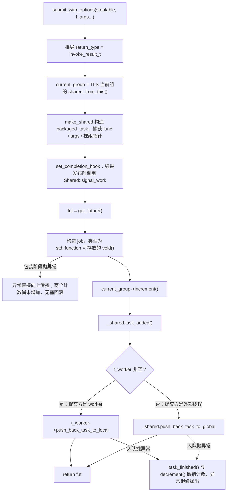

图中的顺序有三处不可交换：结果通道必须在 `job` 之前建立，两个计数必须在入队之前增加，而包装失败与入队失败需要走两条不同的处理路径——前者还没有计数可撤，后者必须先撤销计数再抛出。下面按这四处分别展开。

```cpp
// [pool.hpp:61-100]
  // stealable=false 使 worker 本地任务进入私有队列，不会被其他 worker 窃取。
  template <typename F, typename... Args>
  auto submit_with_options(bool stealable, F &&f, Args &&...args) {
    // 获取任务的返回类型
    using return_type =
        std::invoke_result_t<std::decay_t<F> &, std::decay_t<Args>...>;

    // 当前任务可能属于 block_on：取得该任务组的所有权，保证排队期间仍有效。
    auto current_group = t_current_task_group
                             ? t_current_task_group->shared_from_this()
                             : std::shared_ptr<TaskGroup>{};

    // lambda 只捕获任务组的非拥有指针；job 持有 shared_ptr 管理生命周期。
    auto task_ptr = std::make_shared<fastexec::packaged_task<return_type()>>(
        [func = std::forward<F>(f), ... args = std::forward<Args>(args),
         group = current_group.get()]() -> return_type {
          // 这是一个 RAII 辅助类，用于在任务执行期间临时设置 TLS
          struct ContextGuard {
            TaskGroup *_prev_group;
            explicit ContextGuard(TaskGroup *g)
                : _prev_group(t_current_task_group) {
              // 保存旧上下文并设置当前任务组；嵌套等待后可恢复父任务组。
              t_current_task_group = g;
            }
            ~ContextGuard() {
              // 恢复之前的上下文
              t_current_task_group = _prev_group;
            }
          };

          // 执行用户函数期间，子任务从 TLS 继承该组。
          ContextGuard guard(group);

          // 执行用户实际的函数
          return std::invoke(func, std::move(args)...);
        });
    // 若 worker 正在等待该 future，完成时唤醒其协作执行循环。
    task_ptr->set_completion_hook(&_shared, [](void *shared) noexcept {
      static_cast<Shared *>(shared)->signal_work(true);
    });
```

**返回值推导。** `std::invoke_result_t<std::decay_t<F>&, std::decay_t<Args>...>` 使用 decay 后的参数类型：调用方传入的数组、函数会退化为指针，引用通过 `std::ref` 显式传递。这个类型决定了 `packaged_task<return_type()>` 与返回的 `future<return_type>`，也就是说**返回类型在编译期由调用方签名唯一确定**，运行期不存在类型判断。

**任务组的获取。** `t_current_task_group` 是当前线程的 TLS。若它非空，说明本线程正处于某个 `block_on` 的组内（可能是调用方的 `block_on`，也可能是某个正在运行的任务），此时用 `shared_from_this()` 取得该组的 `shared_ptr` 所有权。这一步的必要性是：`block_on` 里的局部 `shared_ptr` 只保证组在等待期间存活，而任务可能被排入队列、执行得更晚，**排队中的任务必须自己持有一份所有权**，否则组会在被引用之前就被销毁。

**两个指针的分工。** 用户函数体捕获的是 `group = current_group.get()`——一个非拥有指针，写入 TLS 供子任务继承；而 `job`（下一段代码）持有 `current_group` 这个 `shared_ptr` 来维持生命周期。如果用户函数体也捕获 `shared_ptr`，`packaged_task` 与 `job` 之间就会形成所有权环。任务组的实际存活条件因此是：**至少有一个工作项在队列里或正在执行**。

**`ContextGuard` 的作用。** 它把组指针写进 TLS，并在离开时恢复旧值。恢复这一点在嵌套场景下是必需的：[future_test.cpp:115-128](../tests/future_test.cpp#L115-L128) 覆盖的情况是内层 `block_on` 抛异常后，外层组必须重新成为 TLS 的当前值，否则外层随后派生的任务会挂到已经结束的内层组上，导致外层 `block_on` 提前返回。

**`set_completion_hook` 的时机。** 它在 `get_future()` 之前设置，此刻还没有任何线程能看到这个 `future_state`，因此不需要同步。钩子的内容是把 `Shared` 的地址交给结果通道，由后者在结果发布时调用 `signal_work(true)`（见第 6.5 节）。

```cpp
// [pool.hpp:102-129]
    // 获取 future 对象，用于后续获取任务执行结果
    auto fut = task_ptr->get_future();
    // 创建一个函数对象，用于将任务包装成 void() 类型，方便 Worker 执行
    auto job = std::function<void()>(
        [this, task_ptr = std::move(task_ptr), current_group]() mutable {
          try {
            (*task_ptr)();
            // packaged_task 已完成共享状态；即使调用方丢弃子任务 future，
            // 任务组仍能收到用户异常或结果构造异常。
            if (current_group) {
              if (auto error = task_ptr->exception())
                current_group->record_exception(std::move(error));
            }
          } catch (...) {
            // 保护 worker 循环；正常的用户异常已由 packaged_task 捕获。
            if (current_group)
              current_group->record_exception(std::current_exception());
          }
          // 先销毁 callable 与它捕获的资源，再发布任务组完成。
          task_ptr.reset();
          _shared.task_finished();
          if (current_group)
            current_group->decrement();
        });
    // 构造包装器可能抛异常，计数只在包装完成后增加。
    if (current_group)
      current_group->increment();
    _shared.task_added();
```

**为什么需要 `job` 这一层包装器。** 队列存放的 `Task::run` 是 `std::function<void()>`，而 `std::function` 要求目标可拷贝。用户的 callable 可能是只可移动的（例如捕获了 `std::unique_ptr` 的 lambda），无法直接放进 `std::function`。解决办法是把 `packaged_task` 放在 `shared_ptr` 里，让 `job` 只捕获这个 `shared_ptr`——`shared_ptr` 可拷贝，因此 `job` 满足 `std::function` 的约束，而只可移动的用户 callable 安全地留在堆上的 `packaged_task` 内。副作用是 `job` 的拷贝共享同一个 `packaged_task`，但这不影响正确性：`packaged_task` 内部的 `atomic_flag invoked_` 保证任务体只能被调用一次。

**异常的双重投递。** 用户函数抛出的异常在 `packaged_task::operator()` 内部就被捕获并写入 `future_state`（见 6.4 节），不会穿过这里。因此这一层 `catch (...)` 针对的是更外围的失败：`promise::set_value` 时结果对象的移动构造抛异常、或包装器自身内部断言失败。`task_ptr->exception()` 读取共享状态中的异常而**不消耗** future，所以调用方 `future::get()` 仍然会重新抛出同一个异常——异常同时被任务组和调用方观察到，这正是“调用方丢弃子任务 future 后 `block_on` 仍能报告失败”的实现基础。

**清理顺序严格。** `task_ptr.reset()` 先销毁 `packaged_task`，连带销毁用户 callable 以及它捕获的全部资源；之后才执行 `task_finished()` 与 `decrement()`。于是当 `block_on` 观察到组计数归零时，用户资源已经释放完毕。若顺序颠倒，`block_on` 可能在用户对象析构尚未完成时返回。

**计数的增加时机在包装之后。** `current_group->increment()` 与 `_shared.task_added()` 位于 `job` 构造成功之后、入队之前：任务在它能被任何线程看到之前就已经被计数，而如果包装阶段（`make_shared`、`std::function` 构造）抛异常，计数尚未增加，无需回滚。

```cpp
// [pool.hpp:131-148]
    // 检查当前线程是否是 Worker 线程
    try {
      if (t_worker != nullptr) {
        // 如果是 Worker 线程，直接加入到自己的本地队列
        t_worker->push_back_task_to_local(Task{std::move(job), stealable},
                                          _shared.get_global_queue());
      } else {
        // 外部线程，加入到全局队列
        _shared.push_back_task_to_global(Task{std::move(job), stealable});
      }
    } catch (...) {
      _shared.task_finished();
      if (current_group)
        current_group->decrement();
      throw;
    }
    return fut;
  }
```

**入队目标由 `t_worker` 决定**，而不是由任务属性决定：

| 提交线程    | `stealable == true`  | `stealable == false`   |
| ----------- | ---------------------- | ------------------------ |
| worker 内部 | 自己的`_local_queue` | 自己的`_private_queue` |
| 外部线程    | 全局队列，接收者再决定 | 全局队列，接收者再决定   |

外部线程提交时 `stealable` 不立即生效：任务先进入全局队列，由取走它的 worker 在 `get_next_task` 里分流（见 4.2 节）。

**失败回滚。** 入队可能抛异常，最典型的是关闭之后的外部提交（`GlobalQueue::push_back` 抛出 `std::runtime_error`）。此时前面增加的两个计数都需要撤销，否则 `_pending` 永远不为零，worker 无法退出。回滚之后异常继续抛出到调用方，调用方拿不到 future；在栈展开过程中 `job` 与 `packaged_task` 依次销毁，`promise` 在析构时把未完成的状态标记为 broken（见 6.2 节）。

### 5.2 提交时序

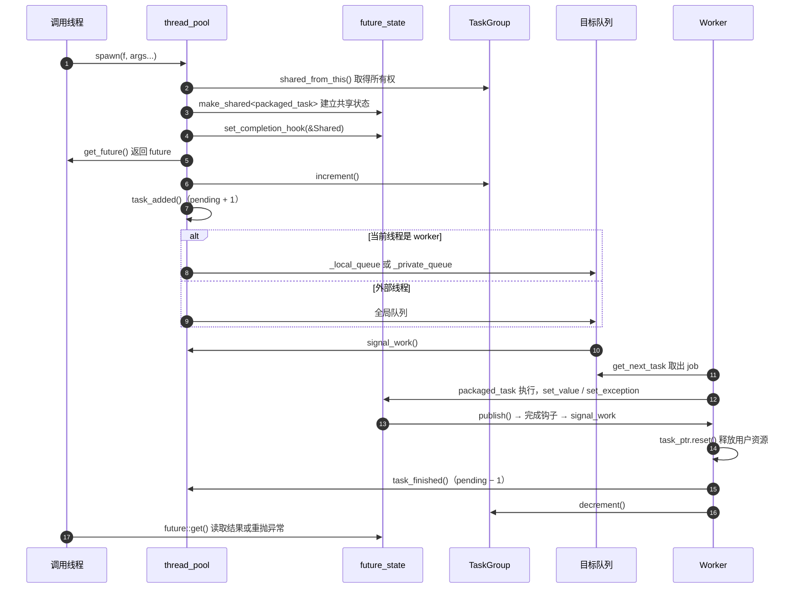

图中最后两步的顺序决定了计数的语义：资源释放先于计数递减，因此计数归零这个事件本身就意味着“任务已经彻底清理完毕”。

### 5.3 公开接口的映射

```cpp
// [exec.hpp:8-11]（线程池实例）
// 内部创建线程池实例
namespace fastexec::__inner {
inline auto &_fastexec_inner_thread_pool =
    fastexec::detail::thread_pool::instance();
```

```cpp
// [exec.hpp:37-63]
// 外部接口
namespace fastexec {
// 非阻塞创建异步任务，返回future
template <typename F, typename... Args> auto spawn(F &&f, Args &&...args) {
  return __inner::_fastexec_inner_thread_pool.submit(
      std::forward<F>(f), std::forward<Args>(args)...);
}

// 可窃取性是提交时的任务属性。false 适合依赖 worker 本地状态的任务。
template <typename F, typename... Args>
auto spawn_with_options(bool stealable, F &&f, Args &&...args) {
  return __inner::_fastexec_inner_thread_pool.submit_with_options(
      stealable, std::forward<F>(f), std::forward<Args>(args)...);
}

// 主动关闭线程池并且等待线程回收
inline void close_and_join() {
  __inner::_fastexec_inner_thread_pool.close();
  __inner::_fastexec_inner_thread_pool.wait_for_all();
}

// 阻塞等待多个任务，返回 tuple
template <typename... Ts>
std::tuple<__inner::detail::future_result_t<Ts>...>
wait(fastexec::future<Ts>... futures) {
  return std::make_tuple(__inner::detail::get_future_value(futures)...);
}
```

`_fastexec_inner_thread_pool` 是一个命名空间作用域的 `inline auto&` 引用，绑定到 `Singleton<thread_pool>::instance()` 返回的函数内静态对象。这带来两个后果：

- 线程池在**首次使用该引用时**（即首次调用任何公开 API）构造，而不是在每次提交时创建。`thread_pool` 的构造函数启动全部 worker 并等待它们注册完成，因此第一次调用的延迟包含线程创建与 `hardware_concurrency()` 个 worker 的启动。
- 引用的初始化本身是线程安全的（函数内静态对象的初始化由标准保证只执行一次），因此多个线程可以并发地首次调用 `spawn`。

`wait` 的 `void` 特化通过类型映射完成：

```cpp
// [exec.hpp:13-34]
namespace detail {
// 定义一个类型特征元函数
template <typename T> struct future_result {
  using type = T;
};
// void特化版本
template <> struct future_result<void> {
  using type = std::monostate;
};
// 重命名类型，进行类型提取
template <typename T> using future_result_t = typename future_result<T>::type;
// 等待future的值
template <typename T>
future_result_t<T> get_future_value(fastexec::future<T> &f) {
  if constexpr (std::is_void_v<T>) {
    f.get();
    return std::monostate{};
  } else {
    return f.get();
  }
}
} // namespace detail
```

`void` 无法成为 `std::tuple` 的元素类型，因此用 `std::monostate` 占位。`get_future_value` 以引用接收 future 并在其中调用 `get()`——`get()` 消耗 future 的内部状态，而参数是左值引用，所以 `make_tuple` 展开时调用的是同一个对象上的连续 `get()`。这也解释了为什么调用方必须显式 `std::move(f)`：`future` 只可移动、不可拷贝，传值形参需要移动构造。多个 future 的失败不会被聚合——`get()` 在第一个异常处抛出，后续 future 不再被读取。

## 6. 结果通道：`future` / `promise` / `packaged_task`

结果通道是一份不依赖线程池的独立实现，只包含 [`future.hpp`](../include/fastexec/future.hpp)。它与标准库 `std::future` 的分工相同：生产者写入结果或异常，消费者读取一次。差异在于本实现额外提供了与 worker 协作等待的钩子，以及一个把返回值保留在自己的类型擦除里的 `packaged_task`。

### 6.1 共享状态与发布协议

```cpp
// [future.hpp:22-59]
namespace detail {

// worker 等待线程池任务时，通过线程局部钩子继续执行队列中的任务。
inline thread_local void* future_help_context{nullptr};
inline thread_local void (*future_help)(void*, const std::atomic<bool>&){nullptr};

// void 用 bool 占位；引用保存地址；普通结果直接保存在共享状态中。
template <class T>
using future_storage_t = std::conditional_t<
    std::is_void_v<T>, bool,
    std::conditional_t<std::is_reference_v<T>, std::reference_wrapper<std::remove_reference_t<T>>, T>>;

// 生产者先写入结果或异常，再以 release 发布 ready。
// 消费者以 acquire 读取 ready 后，便能安全读取其余非原子字段。
template <class T>
struct future_state {
  std::atomic<bool> ready{false};                     // 结果是否已发布
  std::atomic<bool> future_taken{false};              // future 是否已被领取
  std::atomic<bool> worker_waiting{false};            // 是否有 worker 正在协作等待
  std::optional<future_storage_t<T>> value;           // 成功结果
  std::exception_ptr error;                           // 任务异常
  bool broken{false};                                 // promise 未履约就销毁
  void* completion_context{nullptr};                  // 线程池唤醒回调的上下文
  void (*completion_hook)(void*) noexcept {nullptr};  // 线程池唤醒回调

  void publish() noexcept {
    ready.store(true, std::memory_order_release);
    ready.notify_all();

    // 只有 worker 正在等待这个 future 时，才唤醒线程池的工作循环。
    if (completion_hook && worker_waiting.load(std::memory_order_acquire)) {
      completion_hook(completion_context);
    }
  }
};

}
```

**为什么把结果和异常放在同一个 `shared_ptr` 状态里。** `future` 可能先于 `promise` 被销毁（调用方丢弃 future，任务仍在运行），也可能后于 `promise` 被销毁（任务早已完成，调用方稍后取值）。用 `shared_ptr` 共享状态后，两端的生命周期互不依赖：只要还有一方持有，状态就存活。`future` 与 `promise` 都只持有 `shared_ptr`，因此都不需要对方的存活性。

**`void` 与引用的存储映射。** `void` 无法作为 `std::optional` 的元素类型，用 `bool` 占位，`set_value()` 时存 `true`；引用用 `std::reference_wrapper` 保存，保证引用本身不被拷贝，`get()` 时再取回引用；普通值直接存 T。

**发布协议的两段式。** `publish()` 的第一段是 `ready.store(true, release)`：release 保证在此之前的全部写入（`value` 的构造、`error` 的赋值、`broken` 的赋值——都是非原子字段）对任何以 acquire 读到 `ready == true` 的线程可见（6.1 节列出全部字段的发布顺序）。第二段是 `ready.notify_all()`，唤醒那些在外部线程路径上阻塞等待的消费者——外部线程等的是 `ready` 自己的等待队列，与 `work_epoch` 无关。

**钩子只在必要时调用。** `completion_hook` 仅由线程池生成的 `promise` 设置。`worker_waiting` 为假意味着没有 worker 正在协作等待这个结果（绝大多数情况下调用方是从外部线程读结果），此时跳过回调，避免每次结果发布都去递增 `work_epoch` 并唤醒线程池。`ready` 的发布先于钩子调用，因此被钩子唤醒的 worker 重新检查 `ready` 时一定能看到 `true`。

状态只有三种归宿：

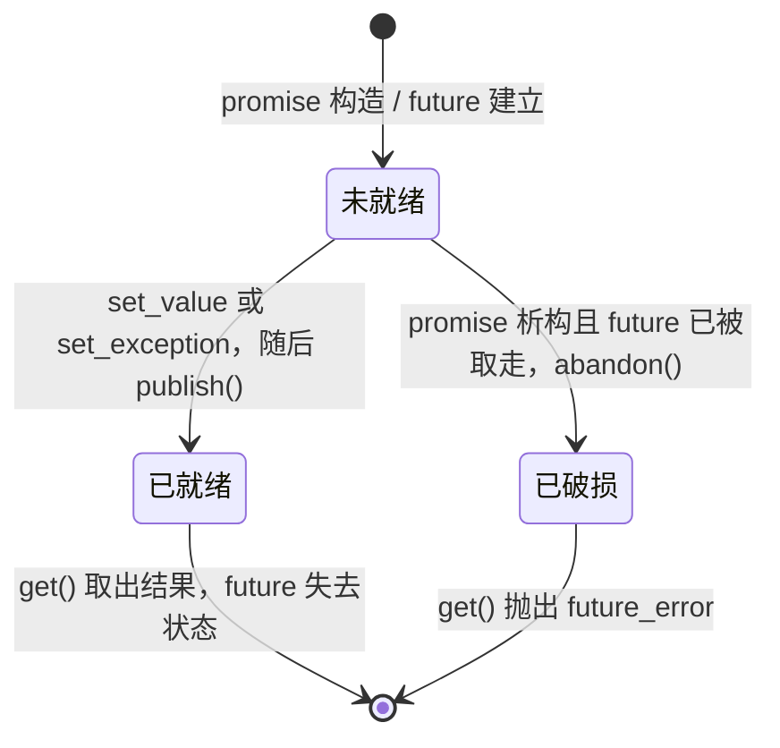

`ready` 一旦为 `true` 就不再改变，因此这个状态机是单向的：不存在“重置后重新履约”的路径，`packaged_task` 的 `invoked_` 标志也是同样的单次语义。

### 6.2 `promise`：唯一生产者

```cpp
// [future.hpp:114-201]（节选）
template <class T>
class promise {
 public:
  promise() : state_(std::make_shared<detail::future_state<T>>()) {}
  promise(promise&&) noexcept = default;
  promise& operator=(promise&& other) noexcept {
    if (this != &other) {
      abandon();                                  // 放弃原状态，避免它永久未就绪
      state_ = std::move(other.state_);
    }
    return *this;
  }
  promise(const promise&) = delete;
  promise& operator=(const promise&) = delete;
  ~promise() { abandon(); }

  future<T> get_future() {
    check_state();
    if (state_->future_taken.exchange(true, std::memory_order_acq_rel)) {
      throw future_error("future already retrieved");
    }
    return future<T>(state_);
  }

  // 线程池在任务发布前设置回调；普通 promise 不需要设置。
  void set_completion_hook(void* context, void (*hook)(void*) noexcept) noexcept {
    state_->completion_context = context;
    state_->completion_hook = hook;
  }

  // packaged_task 完成后读取异常，不消耗对应的 future。
  [[nodiscard]] std::exception_ptr exception() const noexcept { return state_->error; }

  // ……略去 set_value 的三个重载、wait、abandon 与 state_ 成员，下文分别摘录。
```

```cpp
// [future.hpp:163-201]（节选）
  template <class U = T>
  void set_value(std::remove_reference_t<U>& value)
    requires std::is_reference_v<T>
  {
    check_unready();
    state_->value.emplace(value);
    state_->publish();
  }

  void set_exception(std::exception_ptr error) {
    check_unready();
    if (!error) throw std::invalid_argument("null exception");
    state_->error = std::move(error);
    state_->publish();
  }

 private:
  void check_state() const {
    if (!state_) throw future_error("promise has no state");
  }

  void check_unready() const {
    check_state();
    if (state_->ready.load(std::memory_order_acquire)) {
      throw future_error("promise already satisfied");
    }
  }

  void abandon() noexcept {
    if (state_ && !state_->ready.load(std::memory_order_acquire) &&
        state_->future_taken.load(std::memory_order_acquire)) {
      // 析构函数不能分配异常对象；由 future::get 在调用方构造错误。
      state_->broken = true;
      state_->publish();
    }
  }

  std::shared_ptr<detail::future_state<T>> state_;  // 唯一生产者持有的共享状态
};
```

**`get_future` 只允许一次。** `future_taken.exchange(true)` 返回旧值，第二次调用拿到 `true` 并抛出。这是为了维持“一个状态对应一个消费者”的语义：`future::get()` 在读取后会把自己的 `state_` 移出，若允许多个 future 指向同一状态，第二个 future 会读到已被移走的结果。

**`set_value` 的三个重载由 `requires` 区分**：普通值要求可构造、`void` 版本不接受参数、引用版本接收左值引用并存入 `reference_wrapper`。三个版本都先 `check_unready()` 再写入：`check_unready` 与写入之间没有额外的原子保护，因此它约束的是**调用方**而不是并发：`promise` 是唯一生产者，两个线程并发调用 `set_value` 属于使用错误。

**`abandon` 与 broken promise。** `promise` 析构时，如果状态仍未就绪，且 `future` 已经被取走（也就是真的有人可能在等待），就把 `broken` 置位并发布。两个条件缺一不可：

- 未就绪：已经履约的 promise 析构是正常路径。
- `future_taken`：如果调用方从未取过 future，就没有任何观察者，无需产生“破损”事件。`packaged_task` 内部持有 `promise`，其 `get_future()` 可能从未被调用，此时任务完成后析构不会走到这条路。

**为什么用 `bool broken` 而不是在析构里抛异常。** 析构函数抛异常会触发 `std::terminate`（尤其是栈展开过程中）。`broken` 只是一个数据位，真正的 `future_error` 由消费者在 `future::get()` 里构造并抛出，那时构造异常对象是安全的。移动赋值中的 `abandon()` 也遵循同一路径：被替换掉的状态如果已经交给过 future，就标记破损，而不是静默消失。

### 6.3 `future`：单次消费

```cpp
// [future.hpp:78-108]
  void wait() const {
    if (!state_) throw future_error("future has no state");

    if (detail::future_help && state_->completion_hook) {
      // 先登记等待，再检查 ready，避免完成通知发生在登记之前。
      state_->worker_waiting.store(true, std::memory_order_release);
      detail::future_help(detail::future_help_context, state_->ready);
      return;
    }

    // 外部线程直接等待；循环用于处理虚假唤醒。
    while (!state_->ready.load(std::memory_order_acquire)) {
      state_->ready.wait(false, std::memory_order_acquire);
    }
  }

  T get() {
    wait();
    // get 消耗 future；即使后续抛异常，也不允许再次读取。
    auto state = std::move(state_);
    if (state->broken) throw future_error("broken promise");
    if (state->error) std::rethrow_exception(state->error);

    if constexpr (std::is_void_v<T>) {
      return;
    } else if constexpr (std::is_reference_v<T>) {
      return state->value->get();
    } else {
      return std::move(*state->value);
    }
  }
```

**两条等待路径的分派条件。** 进入协作路径需要同时满足两点：当前线程是 worker（`future_help` 非空，由 `Worker` 构造函数设置），并且这个 future 来自线程池（`completion_hook` 非空，由 `submit_with_options` 设置）。手工构造的 `promise/future` 没有钩子，即使在 worker 上调用 `wait()` 也走外部线程路径，直接阻塞在 `ready` 上——此时不会协作执行其他任务，也不会有人替它递增 `work_epoch`。这是结果通道与调度层的交界处：**协作等待的能力只对线程池产生的 future 生效**。

**区分失败原因的顺序。** `get()` 先 `wait()`，再移动出 `state_`（此后 `valid()` 为假，重复调用 `get()` 会抛 `future has no state`），然后依次检查 `broken`、`error`、正常结果。`broken` 优先于 `error`：破损状态意味着从未有结果写入，`value` 与 `error` 都是空的。重抛 `error` 使用 `std::rethrow_exception`，保留原始异常的动态类型，测试 [future_test.cpp:80-86](../tests/future_test.cpp#L80-L86) 验证了 `std::runtime_error` 能穿过整个线程池被捕获。

**返回 `std::move(*state->value)`。** 值以移动方式返回，因此 `future<unique_ptr<int>>::get()` 可以把所有权交给调用方；引用特化走 `reference_wrapper::get()`，返回的是原始对象的引用。测试 [future_test.cpp:101-106](../tests/future_test.cpp#L101-L106) 用 `&same == &referenced` 验证了引用不被拷贝。

### 6.4 `packaged_task`：保留返回值的类型擦除

`std::function<void()>` 会丢掉返回值，而线程池需要把返回值写进 future。因此这里自建了一个类型擦除容器：对外表现为可调用的零参数对象，内部保留 `R` 并持有 `promise<R>`。

```cpp
// [future.hpp:206-244]
template <class R, class... Args>
class packaged_task<R(Args...)> {
  static constexpr std::size_t inline_size = 64;                  // 小对象缓冲区大小
  alignas(std::max_align_t) unsigned char storage_[inline_size];  // 原位存储 callable
  void* object_{nullptr};                                         // 当前 callable 的地址
  R (*invoke_)(void*, Args&&...){nullptr};                        // 类型擦除的调用入口
  void (*destroy_)(void*) noexcept {nullptr};                     // callable 销毁入口
  void (*move_)(void*, void*) noexcept {nullptr};                 // 原位对象的移动入口
  bool heap_{false};                                              // 是否使用堆存储

 public:
  template <class F>
    requires(!std::is_same_v<std::remove_cvref_t<F>, packaged_task>)
  explicit packaged_task(F&& f) {
    using Fn = std::decay_t<F>;
    constexpr bool local = sizeof(Fn) <= inline_size && alignof(Fn) <= alignof(std::max_align_t) &&
                           std::is_nothrow_move_constructible_v<Fn>;
    if constexpr (local) {
      object_ = storage_;
      new (object_) Fn(std::forward<F>(f));
      move_ = [](void* dst, void* src) noexcept {
        new (dst) Fn(std::move(*static_cast<Fn*>(src)));
        static_cast<Fn*>(src)->~Fn();
      };
    } else {
      object_ = new Fn(std::forward<F>(f));
    }

    heap_ = !local;
    invoke_ = [](void* ptr, Args&&... args) -> R {
      return std::invoke(*static_cast<Fn*>(ptr), std::forward<Args>(args)...);
    };
    if constexpr (local) {
      destroy_ = [](void* ptr) noexcept { static_cast<Fn*>(ptr)->~Fn(); };
    } else {
      // 使用与 new Fn 配对的 delete，兼容过度对齐的 Fn。
      destroy_ = [](void* ptr) noexcept { delete static_cast<Fn*>(ptr); };
    }
  }
```

**类型擦除的载体是三个函数指针**，而不是虚函数表：`invoke_` 保留了返回类型 `R`（这正是 `std::function<void()>` 做不到的），`destroy_` 负责按正确类型析构，`move_` 负责在原位存储下搬迁对象。三者都由无捕获 lambda 转换而来，不需要为它们分配内存，也不需要额外的模板实例化开销。

**64 字节原位存储（SBO）的判据**是三条同时成立：尺寸不超过 64、对齐不超过 `max_align_t`、可无异常移动。第三条是必需的，因为 `packaged_task` 的移动构造函数被声明为 `noexcept`（见下），而移动原位对象必须调用其移动构造。不满足任一条件时退化为 `new Fn(...)`，此时 `object_` 指向堆对象，`move_` 保持为空。

**为什么用 `alignas(std::max_align_t)`。** 缓冲区同时要满足任意小对象的对齐要求；`max_align_t` 的对齐足以覆盖常规类型，若用户的 callable 有更高的对齐要求（例如包含 `alignas(64)` 成员的 SIMD 类型），`alignof(Fn) <= alignof(std::max_align_t)` 不成立，自动走堆路径，而堆路径的 `destroy_` 使用与 `new Fn` 配对的 `delete`，对过度对齐类型同样正确。

```cpp
// [future.hpp:246-311]（节选）
  packaged_task(packaged_task&& other) noexcept
      : invoke_(other.invoke_),
        destroy_(other.destroy_),
        move_(other.move_),
        heap_(other.heap_),
        result_(std::move(other.result_)) {
    if (other.object_) {
      if (heap_) {
        object_ = std::exchange(other.object_, nullptr);   // 堆存储：直接交出指针
      } else {
        object_ = storage_;
        move_(object_, other.object_);                     // 原位存储：搬迁后析构源对象
        other.object_ = nullptr;
      }
    }
    if (other.invoked_.test(std::memory_order_relaxed)) {
      invoked_.test_and_set(std::memory_order_relaxed);    // 保持单次调用语义
    }
  }

  // ……略去移动赋值、拷贝构造与拷贝赋值的删除声明。

  ~packaged_task() {
    if (object_) destroy_(object_);
  }

  // ……略去 valid、get_future、set_completion_hook、exception 四个转发成员。

  void operator()(Args... args) {
    if (!object_) throw future_error("packaged_task has no callable");
    if (invoked_.test_and_set(std::memory_order_acq_rel)) {
      throw future_error("packaged_task already invoked");
    }

    try {
      if constexpr (std::is_void_v<R>) {
        invoke_(object_, std::forward<Args>(args)...);
        result_.set_value();
      } else {
        result_.set_value(invoke_(object_, std::forward<Args>(args)...));
      }
    } catch (...) {
      // 用户函数及结果构造的异常都交给 future，不穿过 worker 循环。
      result_.set_exception(std::current_exception());
    }
  }

 private:
  promise<R> result_;                            // 任务的结果生产者
  std::atomic_flag invoked_ = ATOMIC_FLAG_INIT;  // 保证任务只执行一次
};
```

**移动语义把“搬迁”与“移交”分开处理。** 堆存储只需交换指针；原位存储必须在新地址上重新构造对象并析构源对象，`move_` 正是为此存在。`invoked_` 也要一起移交，否则“已执行”的信息会在移动后丢失。

**`operator()` 是异常与结果的收口处。** 它捕获用户函数执行和结果构造（`set_value` 里可能发生移动构造）两处的异常，统一交给 `promise::set_exception`。这解释了为什么 worker 的工作循环里看不到用户异常：异常在这一层就被转换成 `future_state` 里的一个 `exception_ptr`。`invoked_` 用 `test_and_set` 保证任务体只执行一次——这一条在本项目的 `job` 包装里很重要，因为 `std::function` 的拷贝可能共享同一个 `packaged_task`。

**与 `std::packaged_task` 的接口差异。** 本实现没有提供 `reset()`、`make_ready_at_thread_exit()`，也不支持带 `Args` 的显式调用以外的调用形式；`get_future()` 只允许调用一次。它覆盖的是线程池需要的最小集合。

### 6.5 worker 等待 future 的协作路径

把 `Worker` 构造函数里的钩子注册、`submit_with_options` 里的钩子设置、`future::wait` 的协作分支与 `publish` 的钩子调用连起来，就得到 worker 等待自己子任务结果时的完整路径：

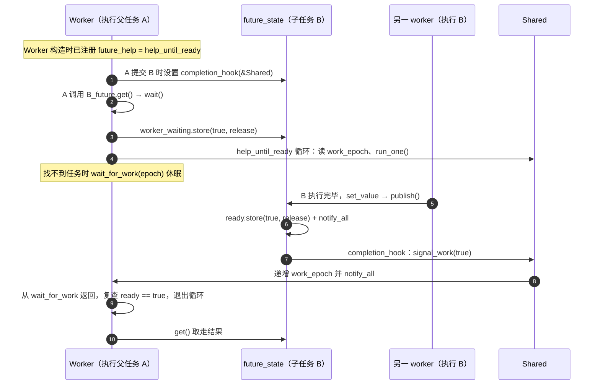

这条链路上有两个独立的唤醒手段，它们针对不同的等待者：

| 等待者             | 等待对象                | 唤醒手段                                                      |
| ------------------ | ----------------------- | ------------------------------------------------------------- |
| 外部线程           | `future_state::ready` | `publish` 中的 `ready.notify_all()`                       |
| worker（协作等待） | `Shared::_work_epoch` | `publish` 中的 `completion_hook` → `signal_work(true)` |

worker 不能只靠 `ready.notify_all()` 唤醒，因为它的休眠发生在 `work_epoch` 上——`help_until_ready` 的循环体读的是 `work_epoch` 并调用 `wait_for_work`。这就是钩子必须存在的理由：它把“结果已就绪”这个事件翻译成“线程池有工作发生”，从而让同一个版本号机制覆盖结果等待和任务等待两种情况。

### 6.6 已界定的边界

- **`future` 不是 `std::future` 的完整替代。** 没有 `wait_for` / `wait_until` 的定时等待，没有 `share()` 产生的 `shared_future`，没有 `std::promise` 的 `set_value_at_thread_exit` 系列接口。
- **`future` 只能被移动，`get()` 只能调用一次。** `valid()` 在 `get()` 之后变为假，再次 `get()` 抛出 `future has no state`。
- **协作等待只覆盖线程池产生的 future。** 手工 `promise/future` 的 `completion_hook` 为空，worker 等待它时走外部线程路径，直接阻塞而不协作执行任务。
- **登记与检查分处两个原子变量。** 设计意图是“先登记 `worker_waiting` 再检查 `ready`”，以避免完成通知落在登记之前。`publish` 的 `ready.store(release)` 与等待方的 `ready.load(acquire)` 之间并不存在跨变量的 happens-before 边，两者的可见性依赖缓存一致性在有限时间内传播：若发布方跳过钩子、等待方也没有观察到 `ready`，worker 会继续停在 `work_epoch` 上，直到下一次 `signal_work`（新任务提交、在途计数归零、任务组归零等）才被唤醒。实际时间窗口在纳秒量级，但它不是由 `happens-before` 保证的。
- **状态字段的并发写入依赖生产者的唯一性。** `value`、`error`、`broken`、`completion_context`、`completion_hook` 都是非原子字段；前三个由唯一的 `promise` 在发布前写入，后两个必须在线程池返回 future 之前设置完成。越过这个前提直接并发使用不构成数据竞争安全。

## 7. 任务组跟踪机制

`block_on` 的语义是“等待一个根任务以及它在同一上下文中派生的全部子任务”。实现这一点的不是线程池的调度逻辑，而是独立的任务组计数加跨线程的上下文传播：提交路径在包装任务时找到当前组的指针，把任务挂进组里；任务执行完毕并清理后把计数减一；计数归零时唤醒等待方。

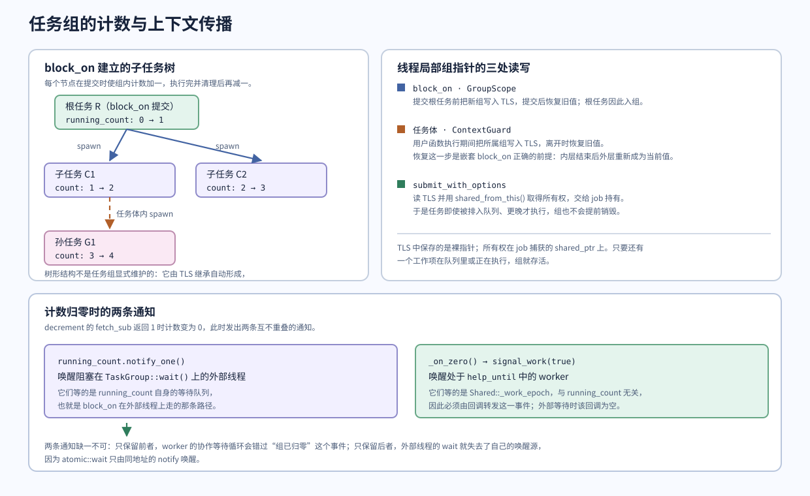

图中左侧的树形结构并不是 `TaskGroup` 显式维护的：组里只有那一个原子计数器，树形关系完全由 TLS 继承在提交时自动形成。右侧三处 TLS 读写构成了这条继承链的完整闭环，底部两条通知则分别对应两类等待者，它们在实现上等待的是两个不同的原子量。

### 7.1 `TaskGroup`

```cpp
// [taskgroup.hpp:12-50]
/**
 *  任务组计数器
 * 用于追踪一组相关任务的完成情况。
 * 内部维护一个原子计数器，支持增加、减少和等待归零操作。
 */
struct TaskGroup : std::enable_shared_from_this<TaskGroup> {
  explicit TaskGroup(std::function<void()> on_zero = {})
      : _on_zero(std::move(on_zero)) {}
  ~TaskGroup() = default;
  // 正在运行（或排队）的任务数量
  std::atomic<size_t> running_count{0};

  // 增加计数：表示有一个新任务加入了该组
  void increment() { running_count.fetch_add(1, std::memory_order_relaxed); }

  // 减少计数：表示该组的一个任务已完成
  void decrement() {
    // fetch_sub 返回修改前的值。如果修改前是 1，说明减完后变成了 0。
    if (running_count.fetch_sub(1, std::memory_order_release) == 1) {
      // block_on 只有一个等待方；worker 内等待还需要唤醒线程池的工作循环。
      running_count.notify_one();
      if (_on_zero)
        _on_zero();
    }
  }

  // 阻塞等待，直到计数器归零
  void wait() {
    size_t count = running_count.load(std::memory_order_acquire);
    while (count != 0) {
      // 使用 C++20 atomic::wait 进行高效等待
      running_count.wait(count);
      count = running_count.load(std::memory_order_acquire);
    }
  }

  [[nodiscard]] size_t count() const {
    return running_count.load(std::memory_order_acquire);
  }
```

**计数的两个方向用了不同的内存序。** `increment` 用 relaxed：增加计数不会发布任何需要被其他线程观察的非原子数据。`decrement` 用 release：离开本函数之前发生的全部写入（包括用户资源的释放、异常写入 `_first_error`）都应当对观察到“计数归零”的等待方可见，而等待方用 acquire 读取计数（`wait` 与 `count`）。

**归零时刻发出两种通知。** 这两行针对两类不同的等待者：

- `running_count.notify_one()` 唤醒阻塞在 `TaskGroup::wait()` 上的**外部线程**——它等的是这个原子量自身的等待队列。
- `_on_zero()` 唤醒 `help_until(group)` 中的 **worker**——它等的是 `Shared::_work_epoch`，与 `running_count` 无关。`block_on` 在 worker 内部运行时会安装这个回调，把它接到 `pool.notify_waiters()`（即 `signal_work(true)`）。

如果只保留前者，worker 的协作等待循环会错过“组已归零”这个事件；如果只保留后者，外部线程的 `wait()` 会依赖 `notify_one` 之外的机制，而 `atomic::wait` 没有其他唤醒源。

**异常记录与计数分离。** 组内异常保存在独立的字段里，并且只在异常路径上加锁：

```cpp
// [taskgroup.hpp:52-73]
  // 多个子任务可能同时失败，只保存第一个异常。锁只在异常路径使用。
  void record_exception(std::exception_ptr error) {
    std::lock_guard lock(_error_mutex);
    if (!_first_error)
      _first_error = std::move(error);
  }

  void rethrow_first_error() {
    std::exception_ptr error;
    {
      std::lock_guard lock(_error_mutex);
      error = _first_error;
    }
    if (error)
      std::rethrow_exception(error);
  }

 private:
  std::function<void()> _on_zero;
  std::mutex _error_mutex;
  std::exception_ptr _first_error;
};
```

`record_exception` 需要互斥是因为多个 worker 可能同时以异常结束各自的任务；只保留第一个写入的异常，因此“哪一个”取决于实际执行顺序，是一个不保证确定性的选择。正常路径不触碰这把锁，计数归零的读取也不需要它——`_first_error` 的最后一次写入发生在某个 `decrement` 之前，而该次 `decrement` 的 release 与等待方的 acquire 构成了读取它的同步基础，锁在此基础上保证可见性与互斥。

### 7.2 上下文传播：TLS 中的组指针

任务组不是通过参数传递的，而是通过线程局部变量继承：

```cpp
// [pool.hpp:14-15]
// 线程局部存储，当前任务所属的任务组指针
inline thread_local TaskGroup *t_current_task_group{nullptr};
```

三个位置读写这个 TLS，构成传播链：

| 位置                    | 动作                     | 代码                                                                                   |
| ----------------------- | ------------------------ | -------------------------------------------------------------------------------------- |
| `block_on`            | 提交根任务前把它设为新组 | `GroupScope`（[exec.hpp:79-89](../include/fastexec/exec.hpp#L79-L89)）                |
| `submit_with_options` | 读取它并取得组的所有权   | `shared_from_this()`（[pool.hpp:69-71](../include/fastexec/detail/pool.hpp#L69-L71)） |
| 任务体                  | 执行期间把它设为所属组   | `ContextGuard`（[pool.hpp:77-92](../include/fastexec/detail/pool.hpp#L77-L92)）       |

传播链的完整性依赖一个不变量：**任务在被执行期间，TLS 中保存的是它所属的组**。于是任务体内调用 `spawn` 时，`submit_with_options` 读到的是同一个组，子任务自动入组；孙任务同理。这就是“整棵子任务树”能够被同一个计数器覆盖的机制。

两处 TLS 写入都使用 RAII，因为它们都必须恢复旧值：

- `GroupScope`（`block_on` 中）在提交前后临时把组写进 TLS。之所以需要它，是因为根任务本身也必须入组，而入组判断发生在 `submit_with_options` 内部读 TLS 的时刻。
- `ContextGuard`（任务体中）在用户函数执行期间把组写进 TLS，并在任务结束时恢复。**恢复**这一步是嵌套 `block_on` 正确性的前提：内层 `block_on` 结束后，外层组必须重新成为当前值，否则外层随后派生的事件会被计入已经结束的内层组。[future_test.cpp:115-128](../tests/future_test.cpp#L115-L128) 验证了这条路径——内层任务组因异常抛出后，外层 `block_on` 仍然捕获到了它随后派生的任务。

**裸指针与所有权分离。** TLS 中存放的是裸指针而不是 `shared_ptr`。原因有两层：`thread_local` 变量在销毁时不会为其中保存的 `shared_ptr` 提供额外的生命周期保证，而更关键的是所有权必须跟随**排队中的工作项**——任务可能在提交很久之后才执行，甚至可能因为队列溢出被搬到全局队列。因此 `submit_with_options` 把这个指针转换成 `shared_ptr` 存在 `job` 里（5.1 节），只要还有一个工作项持有它，组就不会被销毁。

### 7.3 `block_on`

```cpp
// [exec.hpp:65-107]
// 阻塞一个任务，等待他及其所有子任务完成
template <typename F, typename... Args>
static inline decltype(auto) block_on(F &&f, Args &&...args) {
  using result_type =
      std::invoke_result_t<std::decay_t<F> &, std::decay_t<Args>...>;
  auto &pool = __inner::_fastexec_inner_thread_pool;
  // 只有 worker
  // 内等待才需要在组归零时通知线程池；外部等待直接使用组的原子通知。
  std::function<void()> on_zero;
  if (detail::t_worker)
    on_zero = [&pool] { pool.notify_waiters(); };
  auto group = std::make_shared<detail::TaskGroup>(std::move(on_zero));

  // TLS 恢复由 RAII 负责；提交失败、分配失败也不会把任务组留在当前线程。
  auto root = [&]() {
    struct GroupScope {
      detail::TaskGroup *previous;
      explicit GroupScope(detail::TaskGroup *group)
          : previous(detail::t_current_task_group) {
        detail::t_current_task_group = group;
      }
      ~GroupScope() { detail::t_current_task_group = previous; }
    } scope(group.get());
    return pool.submit(std::forward<F>(f), std::forward<Args>(args)...);
  }();

  // 外部线程阻塞等待；worker 则执行本地、全局或窃取来的任务，防止嵌套等待死锁。
  pool.help_until(*group);
  // 先读取根任务结果，再检查子任务异常；根任务失败时优先传播它的异常。
  if constexpr (std::is_void_v<result_type>) {
    root.get();
    group->rethrow_first_error();
    return;
  } else if constexpr (std::is_reference_v<result_type>) {
    auto &result = root.get();
    group->rethrow_first_error();
    return result;
  } else {
    auto result = root.get();
    group->rethrow_first_error();
    return result;
  }
}
```

**根任务提交被包在一个立即调用的 lambda 里。** 这样 `GroupScope` 的构造与析构被限制在提交这一小段作用域内：`submit` 返回后 TLS 已经恢复为之前的值，不需要在函数剩余部分手动维护。注释点明了一个细节——如果 `submit` 抛异常（关闭后提交），`GroupScope` 的析构仍然会执行，因此不会把新组残留在调用线程的 TLS 上。测试 [future_test.cpp:175-180](../tests/future_test.cpp#L175-L180) 在关闭之后调用 `block_on`，并检查 `t_current_task_group == nullptr`。

**`on_zero` 的条件安装。** 回调只在当前线程是 worker 时才设置。外部线程不进入 `help_until` 的协作循环，它直接阻塞在 `TaskGroup::wait()` 上，由 `decrement` 里的 `notify_one` 唤醒；此时安装回调会让每次归零都去递增 `work_epoch` 并唤醒无关的 worker（本线程根本不睡在 `work_epoch` 上）。

**等待阶段。** `pool.help_until(*group)` 内部按 `t_worker` 分流（4.4 节）。这段代码是 `block_on` 的名字来源：调用方在这里被“阻塞”，而 worker 线程在此期间继续执行任务。这个行为对 worker 内调用 `block_on` 是必需的——[future_test.cpp:97-100](../tests/future_test.cpp#L97-L100) 让一个 worker 在任务里再调用 `block_on`，根任务被排进它**自己的**本地队列，只有协作执行才能让它自己跑到那个根任务。

**结果的读取顺序。** 先 `root.get()`，再 `group->rethrow_first_error()`。这个顺序决定了异常的优先级：

| 情况                                | 抛出的异常                                                |
| ----------------------------------- | --------------------------------------------------------- |
| 根任务失败                          | 根任务的异常（`root.get()` 直接抛出，后续检查不再执行） |
| 根任务成功、某个子任务失败          | 组内记录的首个子任务异常                                  |
| 根任务与多个子任务都失败            | 根任务的异常                                              |
| 子任务失败但调用方丢弃了它的 future | 仍然是组内记录的首个子任务异常                            |

最后一行是 `job` 包装器主动记录异常的价值所在（5.1 节）：调用方可以不关心子任务的结果，但 `block_on` 依然能报告失败。[future_test.cpp:137-146](../tests/future_test.cpp#L137-L146) 用 `spawn([] { throw std::runtime_error("child"); })` 且不取 future 的方式验证了这一点。

`decltype(auto)` 配合三个 `if constexpr` 分支，让 `block_on` 支持值、`void` 与引用三种返回类型：引用特化先绑定引用再检查子任务异常，保证返回的引用在异常检查之前已经取得（否则若先抛异常，引用的绑定就不需要了）。

## 8. 共享状态与线程池生命周期

### 8.1 `Shared`：worker 之间的唯一交汇点

worker 之间没有相互引用，所有跨 worker 的信息都经过 `Shared`：

```cpp
// [shared.hpp:13-20]
class Shared : util::noncopyable {
  friend class Worker;

public:
  explicit Shared(std::size_t worker_count) : _stop_latch(worker_count) {
    _workers.reserve(worker_count);
    _workers.resize(worker_count);
  }
```

```cpp
// [shared.hpp:111-119]
private:
  std::vector<Worker *> _workers{};                // 所有注册的 worker
  GlobalQueue _global_queue{};                     // 全局任务队列
  std::atomic<std::size_t> _steal_worker_count{0}; // 窃取任务的 worker 数量
  std::atomic<std::size_t> _pending{
      0}; // 排队与执行中的任务总数，关闭后用于安全退出
  std::atomic<std::uint64_t> _work_epoch{0}; // 工作版本号，用于原子等待
  std::latch _stop_latch; // 等待所有 Worker 线程完成任务
};
```

| 成员                    | 用途                                | 读写者                                            |
| ----------------------- | ----------------------------------- | ------------------------------------------------- |
| `_workers`            | `worker_id` 到 `Worker*` 的映射 | 构造期由`Worker` 写入；窃取时由所有 worker 读取 |
| `_global_queue`       | 全局任务通道                        | 所有线程                                          |
| `_steal_worker_count` | 正在窃取的 worker 数量（软上限）    | `task_steal` 的进入与退出                       |
| `_pending`            | 在途任务总数                        | 每次提交与每次任务完成                            |
| `_work_epoch`         | 工作版本号                          | 所有唤醒点递增；休眠前读取                        |
| `_stop_latch`         | 退出汇合屏障                        | 每个 worker 析构时到达一次                        |

```cpp
// [shared.hpp:42-92]（节选）
  // 全局队列关闭
  void global_queue_close() {
    _global_queue.close();
    signal_work(true);          // 关闭后所有等待者都需要重新评估退出条件
  }
  // ……略去 total_worker_count、get_next_global_task、get_batch_global_tasks、
  // is_global_queue_empty 四个只做转发或查询的成员。
  // 将任务添加到全局任务队列的末尾
  void push_back_task_to_global(Task task) {
    _global_queue.push_back(std::move(task));
    signal_work();
  }
  // ……略去 push_back_batch_task_to_global。
  // 每次出现新任务或关闭时递增版本号，避免 worker
  // 在检查队列与休眠之间丢失唤醒。
  void signal_work(bool all = false) noexcept {
    _work_epoch.fetch_add(1, std::memory_order_release);
    if (all)
      _work_epoch.notify_all();
    else
      _work_epoch.notify_one();
  }
  void task_finished() {
    if (_pending.fetch_sub(1, std::memory_order_acq_rel) == 1)
      signal_work(true);         // 在途计数归零，唤醒等待退出的 worker
  }
  void task_added() { _pending.fetch_add(1, std::memory_order_relaxed); }
  bool all_done() const {
    return _pending.load(std::memory_order_acquire) == 0;
  }
  std::uint64_t work_epoch() const {
    return _work_epoch.load(std::memory_order_acquire);
  }
  void wait_for_work(std::uint64_t epoch) {
    _work_epoch.wait(epoch, std::memory_order_acquire);
  }
```

**`signal_work` 把“发布新任务”与“唤醒”合并成一个原子操作。** 递增版本号用 release：任务的入队操作发生在递增之前，因此被唤醒的 worker 以 acquire 读到新版本号时，也能看到队列中的新任务。

**`task_finished` 的 `fetch_sub` 用 acq_rel。** release 侧发布的是该任务执行期间的全部写入（用户结果、异常记录、资源释放）；acquire 侧则让“读到计数归零”的线程能够看到那些写入。返回值是**修改前**的值，等于 1 意味着本次减完变成 0，此时才需要唤醒。`task_added` 用 relaxed：增加计数不需要发布任何数据。

**队列为空与线程池空闲的关系。** `_pending == 0` 是一个比“队列为空”更强的条件：它不仅要求没有任务在排队，还要求所有已提交的任务都已经执行完最后的清理步骤（`task_finished` 在 `task_ptr.reset()` 之后调用）。因此 worker 退出时，本地队列与全局队列一定都是空的，不会有任务被丢弃。

以上接口中有四个成员在当前代码里没有调用点：`get_next_global_task`、`is_global_queue_empty`、`total_worker_count`、`push_back_batch_task_to_global`（`handle_overflow` 直接调用 `GlobalQueue::push_back_batch`，绕过了 `Shared` 的同名封装）。`LocalQueue::remain_size` 同样只被定义而未在库内使用。它们属于内部 API 的备用入口，理解调度路径时不必跟踪。

### 8.2 `thread_pool`：单例与启动同步

```cpp
// [pool.hpp:150-178]
private:
  // 构造函数，创建线程池并初始化工作者
  explicit thread_pool() noexcept {
    // 启动工作线程
    work();
  }

  // 工作函数，创建线程并运行工作者
  void work() {
    for (std::size_t i = 0; i < _thread_num; ++i) {
      _threads.emplace_back([this, i]() {
        detail::Worker worker{&_shared, i};
        // 等待所有的worker全部创建完成(shared内的worker数组完整注册好)
        sync_start.arrive_and_wait();
        // 统一启动run
        worker.run();
      });
    }
    // 等待所有线程启动完成，此函数才执行完成
    sync_start.arrive_and_wait();
  }

private:
  std::size_t _thread_num{
      std::max(1u, std::thread::hardware_concurrency())}; // 线程数
  std::vector<std::jthread> _threads{};                   // 线程池
  Shared _shared{_thread_num};                            // 共享状态
  std::latch sync_start{
      static_cast<std::ptrdiff_t>(_thread_num + 1)}; // 同步标志
```

**`std::latch` 在这里承担两个作用。** 计数是 `_thread_num + 1`，多出来的 1 是调用 `work()` 的主线程：

1. **保证 `Shared::_workers` 在任何人读取它之前已完整填充。** `Worker` 构造函数的第一件事是 `register_worker(id, this)`。如果 worker 注册完成后立刻进入 `run()`，它可能在 `_workers` 尚未全部填充时就去窃取（`get_workers()` 返回一个含 `nullptr` 的跨度），或者在 `Shared::can_steal_task` 里读到不完整的规模。latch 让所有 worker 的注册全部完成之后才统一放行。
2. **保证 `thread_pool` 的构造在 worker 进入工作循环之后才返回。** 主线程最后到达 latch，此时所有 worker 都已经构造完毕并阻塞在同一屏障上；主线程到达后全体释放。

两个作用合起来的效果是：`thread_pool::instance()` 返回时，`_workers` 已经可用，并且所有 worker 都已经开始或即将开始取任务。首次调用 `spawn` 不会被“worker 还没起来”的竞态影响。

`_thread_num` 取 `std::max(1u, hardware_concurrency())`：`hardware_concurrency()` 允许返回 0（无法获取时），此处用 1 兜底，保证至少有一个 worker。

**构造函数标记为 `noexcept`。** 它调用的 `work()` 会构造 `std::jthread` 与 `Worker`，两者都可能因资源耗尽而抛出 `std::system_error`（线程创建失败、`std::vector` 扩容失败）。`noexcept` 意味着这些异常会直接触发 `std::terminate` 而不是向上传播。这是一个刻意的取舍：单例的构造无法通过 `try/catch` 的方式重试或降级，硬失败比让调用方拿到一个半初始化的线程池更可控。

### 8.3 关闭与退出

```cpp
// [pool.hpp:17-52]（节选）
class thread_pool : public util::Singleton<thread_pool> {
  friend class util::Singleton<thread_pool>;

public:
  // 析构函数，停止线程池并等待所有线程完成
  ~thread_pool() {
    if (!_shared.get_global_queue().closed()) {
      close();                     // 用户没有显式关闭时补一次
    }
    for (auto &thread : _threads) {
      if (thread.joinable()) {
        thread.join();
      }
    }
  }

  void close() { _shared.global_queue_close(); }
  // ……略去 submit / submit_with_options / help_until / notify_waiters 等成员。
  // 等待所有任务完成
  void wait_for_all() {
    // 等待所有 Worker 线程完成任务
    for (auto &worker : _threads) {
      if (worker.joinable())
        worker.join();
    }
  }
```

```cpp
// [exec.hpp:52-56]
// 主动关闭线程池并且等待线程回收
inline void close_and_join() {
  __inner::_fastexec_inner_thread_pool.close();
  __inner::_fastexec_inner_thread_pool.wait_for_all();
}
```

关闭是两段式的：`close()` 只把全局队列标记为关闭并唤醒所有等待者，不阻塞；`wait_for_all()` 才真正 `join` 线程。`close_and_join` 把两者连起来。分开的意义在于 `close()` 之后、`join()` 之前，已经运行的任务仍能派生子任务（`internal = true` 的通道未关闭），因此“关闭”表达的是“拒绝新的外部工作”，而不是“立刻停止”。

退出条件是 `run()` 里的联合判断：

```cpp
// [worker.hpp:50-51]
      if (_shared->get_global_queue().closed() && _shared->all_done())
        break;
```

单独满足任一项都不退出：全局队列已关闭但在途任务不为零时，worker 仍需继续执行（可能还需要窃取别人的队列来完成剩余任务）；在途任务为零但队列未关闭时，外部随时可能提交新任务。

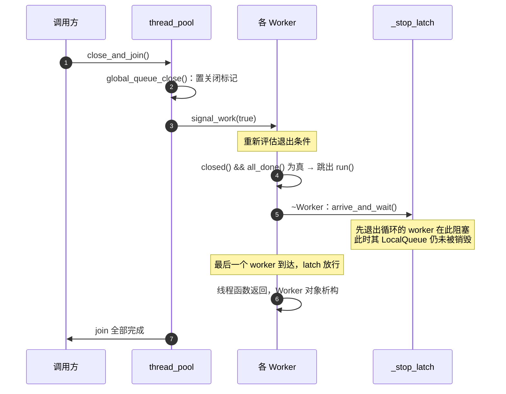

**`_stop_latch` 是防止队列被提前析构的屏障。** `Worker` 对象是线程函数里的局部变量，析构发生在 `run()` 返回之后，此时 `_local_queue` 与 `_private_queue` 都会被销毁。但其他仍在 `run()` 循环里的 worker 有可能正通过 `task_steal` 访问这个 `_local_queue`（`be_stolen_by` 直接读写目标 worker 的槽位数组）。如果先退出循环的 worker 不等其他人就析构，正在窃取的 worker 就会访问已释放的内存。`std::latch` 的计数是 worker 总数，每个 worker 在析构函数里到达一次：

- 先离开循环的 worker 阻塞在 `arrive_and_wait()`，**此时它的队列尚未析构**，仍在循环中的 worker 可以安全地继续窃取；
- 最后一个 worker 到达后 latch 放行，此后不再有任何线程处于 `run()` 循环内，所有 `Worker` 对象才可以安全析构。

`join` 与 latch 的区别也在这里：`join` 保证线程函数已经返回，前提是线程自己会退出；latch 保证的是**所有线程同时穿过退出点**，这样析构才安全。两者配合的顺序是——latch 让 worker 群体一起通过退出点，`join` 让调用方确认每个线程确实已经结束。

**析构函数补一次 `close()`。** 如果用户从未调用 `close_and_join`（线程池作为函数内静态对象在程序退出时销毁），析构函数需要先把队列关掉，否则 worker 会永远等在 `wait_for_work` 上，`join` 永不返回。这也是 `close()` 与 `wait_for_all()` 分离带来的一个便利：两条关闭路径共享同一段 `join` 逻辑。

### 8.4 单例与静态销毁

```cpp
// [util.hpp:16-27]
// 单例类，用于创建全局唯一的实例
template <typename T>
class Singleton {
 public:
  static auto instance() -> T & {
    static T instance;
    return instance;
  }
};
```

`instance()` 返回函数内静态对象，由标准保证初始化只执行一次且线程安全。`thread_pool` 通过 `friend class util::Singleton<thread_pool>` 让模板函数能够调用其私有构造函数，因此线程池只能经由 `instance()` 创建。

销毁时机由静态存储期的规则决定：函数内静态对象在程序退出时按构造顺序的逆序销毁。`exec.hpp` 中的 `inline auto& _fastexec_inner_thread_pool` 绑定到这个对象，并不延长其生命周期。由此产生的边界有两条：

- 线程池的析构会 `join` 全部 worker，因此只要程序正常退出，worker 线程一定会被回收，不依赖用户显式调用 `close_and_join`。
- 如果其他静态对象在**其自身析构**过程中调用 `spawn`，而线程池已经先被销毁，则属于静态销毁顺序问题；`exec.hpp` 的引用在此时指向一个已析构的对象。跨翻译单元的静态对象析构顺序不可控，这类调用没有防护。

`thread_pool` 的 `~thread_pool` 也会在关闭后 `join`，所以 `close_and_join()` 与“什么都不做直接退出”的最终效果相同，区别只在于前者能确定性地控制关闭发生的时刻，从而在关闭之后、程序退出之前观察到队列状态（例如 [future_test.cpp:169-174](../tests/future_test.cpp#L169-L174) 里在关闭之后检查子任务是否全部完成）。

## 9. 端到端执行追踪

以下面这段代码为例，逐步追踪三个模块的协作过程：

```cpp
int main() {
  auto value = fastexec::block_on([] {
    auto child = fastexec::spawn([] { return 21; });
    return child.get() * 2;
  });
  std::cout << value << '\n';   // 42
  fastexec::close_and_join();
}
```

|  # | 位置                        | 状态变化                                                                                                                                                                                               |
| -: | --------------------------- | ------------------------------------------------------------------------------------------------------------------------------------------------------------------------------------------------------ |
|  1 | `block_on` 入口           | `t_worker == nullptr`（主线程），因此 `on_zero` 为空；创建 `TaskGroup`，`running_count = 0`                                                                                                    |
|  2 | `GroupScope` 构造         | 主线程 TLS：`t_current_task_group = 新组`                                                                                                                                                            |
|  3 | `pool.submit(...)`        | `submit_with_options` 读 TLS 得到 `current_group`（非空）→ `increment()` 使计数为 1；`task_added()` 使 `_pending` 为 1                                                                      |
|  4 | 入队                        | 主线程不是 worker → 根任务进入**全局队列**；`signal_work()` 递增 `work_epoch` 并 `notify_one`                                                                                             |
|  5 | `GroupScope` 析构         | 主线程 TLS 恢复为`nullptr`                                                                                                                                                                           |
|  6 | `pool.help_until(group)`  | `t_worker == nullptr` → 走 `group.wait()`，主线程阻塞在 `running_count` 上                                                                                                                      |
|  7 | 某 worker 的`run_one`     | `get_next_task` 中私有队列与本地区队列均为空 → 从全局队列批量取任务，`_pending` 不变                                                                                                              |
|  8 | 执行根任务                  | `packaged_task` 的 callable 里 `ContextGuard` 把该 worker 的 TLS 设为根任务所属的组                                                                                                                |
|  9 | 根任务内`spawn`           | 该 worker 的`t_worker` 非空 → 子任务进入它的私有队列（`spawn` 默认可窃取，实际进入 `_local_queue`）；`increment()` 使计数为 2，`_pending` 为 2                                              |
| 10 | 根任务返回 21               | `packaged_task::operator()` 调用 `promise<int>::set_value(21)` → `future_state::publish`：`ready` 以 release 置真                                                                             |
| 11 | 根任务工作项收尾            | `task_ptr.reset()` 释放 callable；`_pending` 减为 1（未归零，不唤醒）；本组 `decrement()` 使计数为 1（未归零）                                                                                   |
| 12 | 根任务体内的`child.get()` | worker 的`future_help` 与 `completion_hook` 都非空 → 走协作路径：登记 `worker_waiting` 后进入 `help_until_ready`。由于第 10 步已经发布 `ready`，`ready.load` 立刻为真，循环不进入休眠     |
| 13 | 子任务被执行                | 可能由本 worker 从自己的`_local_queue` 取出，也可能被其他 worker 窃取后执行；执行完毕 `publish` + `task_finished()`（`_pending` 减为 0 → `signal_work(true)`）+ `decrement()`（计数为 1） |
| 14 | 根任务返回 42               | `set_value(42)` 发布根任务结果；工作项收尾使本组计数归零 → `notify_one` 唤醒主线程（`_on_zero` 为空，不做额外通知）                                                                             |
| 15 | `block_on` 收尾           | `root.get()` 读出 42；`group->rethrow_first_error()` 无异常；主线程 TLS 保持 `nullptr`                                                                                                           |
| 16 | `close_and_join`          | 全局队列置关闭标记并`notify_all`；各 worker 在 `run()` 中看到 `closed() && all_done()` 为真，跳出循环，到达 `_stop_latch`；主线程 `join` 完成                                                |

需要注意的是第 12 步：`child.get()` 能在同一个 worker 上得到结果，依赖的是 `block_on` 与 `spawn` 都对该 worker 生效的两个前提——子任务排在它自己的本地队列里（步骤 9），以及等待期间它会协作执行任务（步骤 12）。如果子任务被声明为不可窃取（`spawn_with_options(false, ...)`），第 12 步的协作执行就成为它被执行的**唯一**途径：私有队列不可能被其他 worker 取到。
