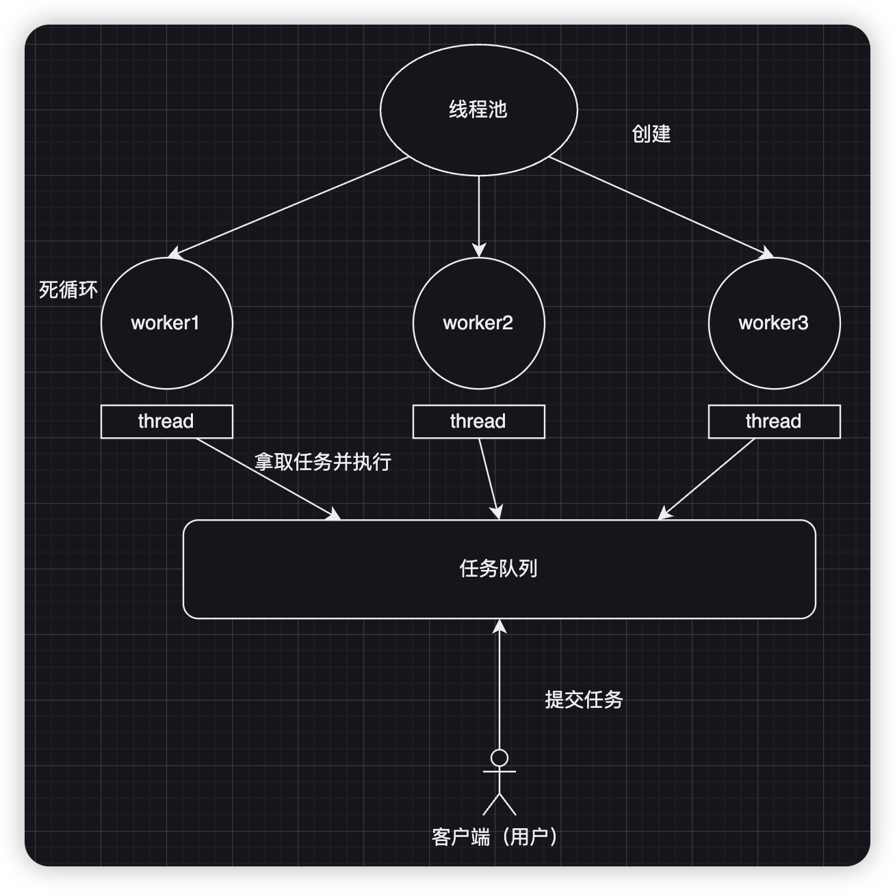
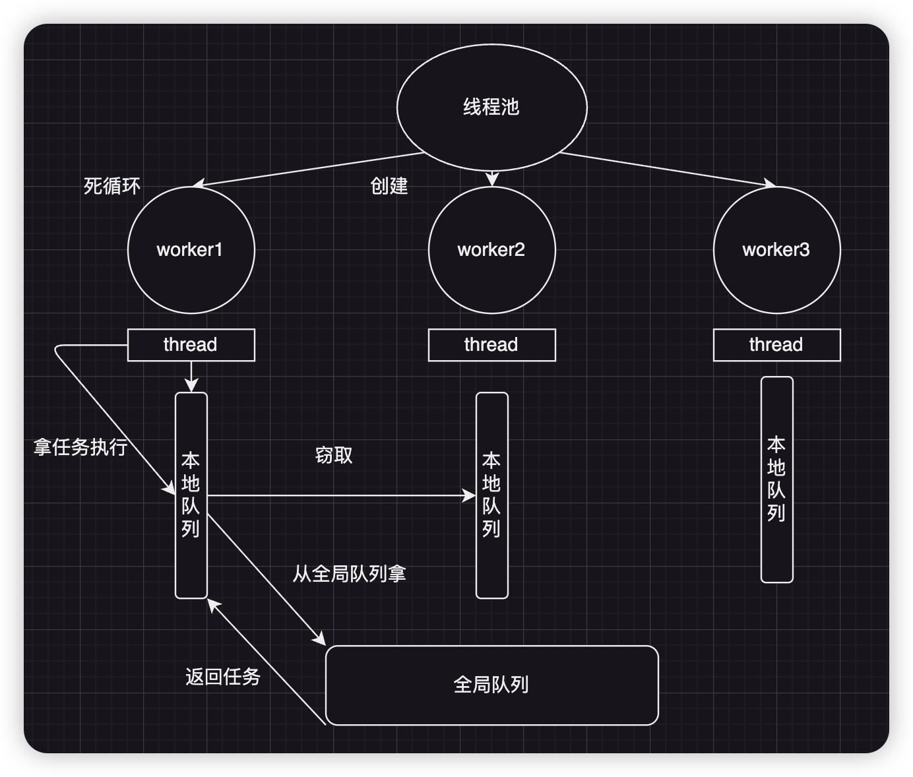

## 1 生产者-消费者模式

**生产者-消费者模式**是一种经典的并发协作模式，它通过引入一个**共享的缓冲区**（通道），将数据的生产（由生产者完成）和数据的消费（由消费者完成）进行解耦。

生产者-消费者模式的核心架构包含以下四个关键组件：
- **生产者 (Producer)**：负责创建"产品"的组件。它可以是一个或多个线程/进程，按照一定的逻辑生成数据或任务。
- **产品 (Product)**：生产者创建的数据或任务单元，是生产者与消费者之间传递的具体内容。
- **通道 (Channel)**：作为生产者和消费者之间的**缓冲区**，负责产品的临时存储和传递。此通道可以是有界的（容量固定）或无界的（容量可动态增长），通常实现为线程安全的队列结构。
- **消费者 (Consumer)**：负责从通道中取出产品并进行处理的组件。同样可以是一个或多个线程/进程。

## 2 Worker-Thread模式

**Worker-Thread模式**（又称工人线程模式或线程池模式）的核心思想是**复用线程**来避免频繁创建和销毁线程带来的性能开销。在该模式中，一组工作线程（Worker Thread）被预先创建并维护在线程池中，当有任务到达时，从线程池中分配一个空闲工作线程来执行任务，任务完成后线程返回池中等待下一次任务分配。

Worker-Thread模式包含以下核心组件：
- **客户端 (Client)**：任务提交者，负责创建任务并将其提交给通道（Channel）。
- **请求 (Request)**：表示需要执行的工作单元，封装了任务的执行逻辑。
- **通道 (Channel)**：作为任务队列，负责接收和缓存客户端提交的请求。此通道通常是线程安全的阻塞队列。
- **工作者 (Worker)**：工作者线程，不断从通道中获取请求并执行。多个工作者线程共同组成**线程池**。
- **线程池 (Thread Pool)**：管理和维护工作者线程的集合，负责线程的创建、回收和任务分配。

## 3 工作窃取模式 (Work-Stealing Pattern)

**工作窃取模式**是一种用于提高并行计算效率的负载均衡技术。在该模式中，每个工作线程维护一个**专属的任务队列**，当自身队列中的任务处理完毕后，工作线程不会空闲等待，而是随机选择其他工作线程的队列，"窃取"其中的任务来执行。

工作窃取模式的核心架构包含以下组件：

- **任务队列池 (Task Queue Pool)**：由多个线程专属的任务队列组成的集合，每个工作线程有一个私有队列。
- **工作线程 (Worker Thread)**：执行任务的工作单元，每个线程绑定一个专属任务队列。
- **任务 (Task)**：可并行执行的工作单元，通常包含可以进一步分解的子任务。
- **窃取算法 (Stealing Algorithm)**：定义工作线程如何选择窃取目标及如何转移任务的策略。

